<p align="center">
  
</p>

<h1 align="center">Kolo</h1>

<p align="center">
  <b>Real-Time Collaborative Study Workspace</b><br/>
  <i>Create a study space → Invite classmates → Collaborate live → Capture knowledge → Revisit later</i>
</p>

<p align="center">
  <a href="https://study-sync-up.vercel.app"><b>🌐 Live App — study-sync-up.vercel.app</b></a>
</p>

<p align="center">
  
  
  
  
  
  
  
  
  
  
  
</p>

---

## Table of Contents

- [Overview](#overview)
- [Problem Statement](#problem-statement)
- [Product Vision](#product-vision)
- [Features](#features)
- [Architecture](#architecture)
  - [High-Level Architecture](#high-level-architecture)
  - [Directory Structure](#directory-structure)
  - [Data Flow](#data-flow)
- [Tech Stack](#tech-stack)
- [Database Schema](#database-schema)
- [Authentication & Authorization](#authentication--authorization)
  - [Session Flow (Access + Refresh Tokens)](#session-flow-access--refresh-tokens)
  - [Permission Model (RBAC)](#permission-model-rbac)
  - [WebSocket Auth Flow](#websocket-auth-flow)
  - [Rate Limits](#rate-limits)
- [API Reference](#api-reference)
  - [Auth Routes](#auth-routes)
  - [Study Space Routes](#study-space-routes)
  - [Member & Invite Routes](#member--invite-routes)
  - [Message Routes](#message-routes)
  - [Resource Routes](#resource-routes)
  - [Pin & Highlight Routes](#pin--highlight-routes)
  - [Activity, Versions, AI, Search & Notifications](#activity-versions-ai-search--notifications)
- [WebSocket Events](#websocket-events)
- [Real-Time Collaboration (CRDT)](#real-time-collaboration-crdt)
- [Live Updates](#live-updates)
- [Invite & Join System](#invite--join-system)
- [AI Study Assistant](#ai-study-assistant)
- [Interface — Themes & Layouts](#interface--themes--layouts)
- [User Journeys](#user-journeys)
- [Redis & Horizontal Scaling](#redis--horizontal-scaling)
- [Getting Started](#getting-started)
- [Deployment](#deployment)
- [Testing](#testing)
- [Contributing](#contributing)
- [License](#license)

---

## Overview

**Kolo** (formerly StudySync) is a real-time collaborative study workspace where students create shared spaces, invite peers, jointly edit notes, discuss problems, share solutions and resources, preserve important knowledge through pins/highlights, ask an AI tutor that has read their notes, and recover seamlessly from connection failures.

> **Product Thesis:** _Don't build another generic notes app. Build a shared digital study room._

Kolo is deliberately positioned as a **study-specific collaboration environment**, not a general productivity tool. The core experience is a shared "Study Space" containing collaborative notes, conversations, resources, pinned/highlighted information, and group members — all updating live for everyone in it.

| | |
|---|---|
| 🌐 **Frontend** | Hosted on **Vercel** — [study-sync-up.vercel.app](https://study-sync-up.vercel.app) |
| ⚙️ **Backend** | Hosted on **Render** (Node.js + Express + Socket.IO + Yjs WebSocket) |
| 🗄️ **Database** | **MongoDB Atlas** |
| ⚡ **Real-time layer** | **Upstash Redis** — Socket.IO Redis adapter (pub/sub + room/presence registry) |

---

## Problem Statement

Students currently split group study across **multiple disconnected tools**:

| Tool | Purpose |
|------|---------|
| WhatsApp / Telegram | Conversations |
| Google Docs | Notes |
| Google Drive | Files |
| Discord / Meet | Voice & screen sharing |
| Notion | Organization |
| ChatGPT / Gemini | AI assistance |

**This fragmentation causes:**

1. Important answers and resources disappear in chat history
2. Notes and discussions are disconnected
3. Late joiners can't catch up easily
4. No study-focused context linking conversations, notes, and resources
5. Students need a lightweight workspace for a single exam/topic/project

**Kolo brings the core study workflow into one collaborative space.**

---

## Product Vision

```
Create a study space → Invite classmates → Collaborate live
→ Capture important knowledge → Revisit later
```

### What Kolo IS

A focused **real-time academic collaboration workspace** for students and small study/project groups.

### What Kolo is NOT

- ❌ Notion replacement
- ❌ Full LMS
- ❌ Video conferencing platform
- ❌ Social network
- ❌ Google Drive clone
- ❌ Generic AI chatbot

---

## Features

| Area | What you can do |
|------|-----------------|
| 📝 **Shared Notes** | Edit together in real time (Yjs CRDT), see each other's cursors, keep working offline, save and restore versions |
| 💬 **Discussion** | Live chat with typing indicators, edit/delete, unread counts, jump to any message from pins or search |
| 📎 **Resources** | Share links, images, PDFs, documents and code snippets (uploads up to 10 MB) |
| 📌 **Pins & Highlights** | Pin the answer; highlight as important, exam-important, doubt, solution, reference or to-do |
| 🕘 **Activity Feed** | Who joined, uploaded, pinned, restored — in order |
| 🔎 **Search** | One search across messages, resources, pins, highlights and spaces |
| ✨ **AI Assistant** | Ask about the notes, summarise the chat, generate quizzes, explain a selection, create revision notes |
| 🔗 **Invites** | Link + code (`W6A-BEC`), expiry and member limit (presets or custom), pause, regenerate, email |
| 👥 **Members & Presence** | See who is online, owner can remove members, live member counts |
| 🔔 **Notifications** | Invites, new members, removals — delivered live |
| 🔐 **Accounts** | Email/password or Google sign-in, sessions that expire, profile photo with crop |
| 🎨 **Interface** | Light / System / Dark themes; layouts for phones, tablets (both orientations) and desktop |

---

## Architecture

### High-Level Architecture

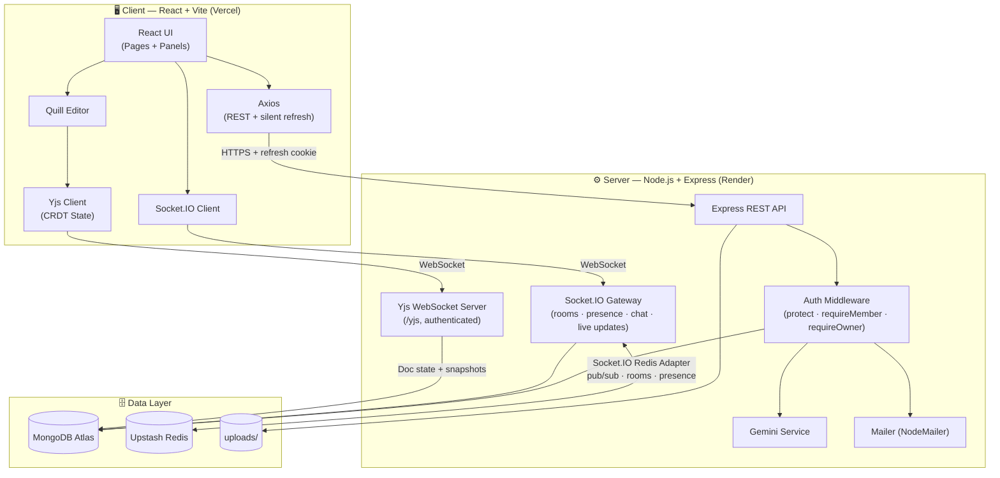
```mermaid
graph TB
    subgraph Client["🖥️ Client — React + Vite (Vercel)"]
        UI["React UI<br/>(Pages + Panels)"]
        QE["Quill Editor"]
        YC["Yjs Client<br/>(CRDT State)"]
        SC["Socket.IO Client"]
        AX["Axios<br/>(REST + silent refresh)"]
    end

    subgraph Server["⚙️ Server — Node.js + Express (Render)"]
        REST["Express REST API"]
        AUTH["Auth Middleware<br/>(protect · requireMember · requireOwner)"]
        SIO["Socket.IO Gateway<br/>(rooms · presence · chat · live updates)"]
        YWS["Yjs WebSocket Server<br/>(/yjs, authenticated)"]
        AIS["Gemini Service"]
        MAIL["Mailer (NodeMailer)"]
    end

    subgraph Data["🗄️ Data Layer"]
        MONGO[(MongoDB Atlas)]
        REDIS[(Upstash Redis)]
        DISK[("uploads/")]
    end

    UI --> AX
    UI --> QE
    QE --> YC
    UI --> SC

    AX -->|HTTPS + refresh cookie| REST
    SC -->|WebSocket| SIO
    YC -->|WebSocket| YWS

    REST --> AUTH
    AUTH --> MONGO
    AUTH --> AIS
    AUTH --> MAIL
    REST --> DISK
    SIO --> MONGO
    YWS -->|Doc state + snapshots| MONGO

    SIO <-->|Socket.IO Redis Adapter<br/>pub/sub · rooms · presence| REDIS
```

> **Note:** Two WebSocket channels run side by side — **Socket.IO** for chat, presence and live updates, and a **raw Yjs WebSocket** for the shared notes. Both authenticate with the same short-lived access token and check space membership.

### Directory Structure

```
Kolo/
├── 📄 StudySync_PRD.md              # Product Requirements Document
├── 📄 MEMORY.md                     # Implementation tracking
├── 📄 README.md                     # Project documentation
│
├── 📁 client/                       # Frontend — React + Vite + Tailwind v4 (deployed on Vercel)
│   ├── index.html                   # SPA entry, fonts
│   ├── vercel.json                  # Rewrites every path to index.html (refresh + deep links)
│   ├── package.json
│   ├── vite.config.js
│   └── src/
│       ├── main.jsx                 # React DOM render
│       ├── App.jsx                  # Router, providers, 404 route
│       ├── index.css                # Brand tokens, light/dark themes, Quill + prose theming
│       ├── app-theme.css            # Tailwind palette re-mapped for the app screens
│       ├── lib/
│       │   ├── api.js               # Axios + in-memory access token + silent refresh
│       │   ├── ai.js                # AI assistant calls
│       │   ├── google.js            # Google client id
│       │   ├── motion.js            # GSAP helpers
│       │   └── spaceIcons.js        # Space icon set
│       ├── context/
│       │   ├── AuthContext.jsx      # Restore session, login/register/Google, cross-tab sync
│       │   └── SocketContext.jsx    # Socket.IO client, re-auth on reconnect
│       ├── hooks/                   # useTheme · useReveal · usePopIn
│       ├── components/
│       │   ├── auth/                # AuthLayout, AuthForm, GoogleSignInButton, ProtectedRoute
│       │   ├── landing/             # Landing page sections (Hero, LivePreview, Features, FAQ…)
│       │   ├── layout/              # AppShell, Topbar, ThemeToggle, NotificationsBell
│       │   ├── motion/              # RouteTransition, Reveal
│       │   ├── space/
│       │   │   ├── CollaborativeEditor.jsx  # Quill + Yjs CRDT editor
│       │   │   ├── ChatPanel.jsx            # Discussion
│       │   │   ├── AIPanel.jsx              # AI study assistant
│       │   │   ├── ResourcesPanel.jsx       # Files, links, snippets
│       │   │   ├── PinsPanel.jsx · HighlightsPanel.jsx
│       │   │   ├── ActivityPanel.jsx · MembersPanel.jsx · VersionsPanel.jsx
│       │   │   └── *Modal.jsx               # Create, Join, Edit, Delete, Invite, Highlight, AddResource
│       │   └── ui/                  # Button, Card, Input, Label, Modal, Markdown
│       └── pages/
│           ├── LandingPage.jsx      # Marketing landing
│           ├── LoginPage.jsx        # Login
│           ├── SignupPage.jsx       # Registration
│           ├── DashboardPage.jsx    # User's study spaces (live)
│           ├── WorkspacePage.jsx    # Study space workspace
│           ├── SearchPage.jsx       # Search results
│           ├── ProfilePage.jsx      # Profile & password
│           ├── JoinPage.jsx         # Invite link landing (/join/:code)
│           └── NotFoundPage.jsx     # 404
│
└── 📁 server/                       # Backend — Express + Mongoose (deployed on Render)
    ├── index.js                     # Middleware, routes, health check, Render self-ping
    ├── package.json
    ├── config/
    │   ├── db.js                    # MongoDB connection
    │   ├── redis.js                 # Upstash Redis connection (pub + sub clients, TLS)
    │   ├── mailer.js                # NodeMailer (optional)
    │   ├── socket.js                # Socket.IO server: auth, rooms, presence, chat
    │   └── yjs.js                   # Yjs WebSocket server on /yjs: auth, persistence, snapshots
    ├── controllers/                 # auth, space, member, invite, message, resource, pin,
    │                                # highlight, activity, snapshot, ai, search, notification
    ├── middleware/
    │   ├── auth.js                  # protect (access token)
    │   ├── space.js                 # requireMember / requireOwner
    │   ├── rateLimiter.js           # Per-route budgets
    │   ├── validate.js              # express-validator rules
    │   ├── upload.js                # multer uploads
    │   └── error.js                 # Global error handler
    ├── models/                      # User, Session, StudySpace, Membership, Message, Resource,
    │                                # Pin, Highlight, Activity, DocumentSnapshot, Notification
    ├── routes/                      # auth, spaces, ai, notifications, search
    ├── services/
    │   └── geminiService.js         # Gemini prompts, model fallback, timeouts
    ├── utils/
    │   ├── session.js               # Refresh-token sessions (rotate, revoke, cookies)
    │   ├── live.js                  # Watch rooms for live dashboard updates
    │   ├── generateToken.js         # Access token (JWT)
    │   ├── joinCode.js              # XXX-XXX join codes
    │   └── logActivity.js · notify.js · emailTemplates.js
    └── scripts/
        └── seed.js                  # Database seeder
```

### Data Flow

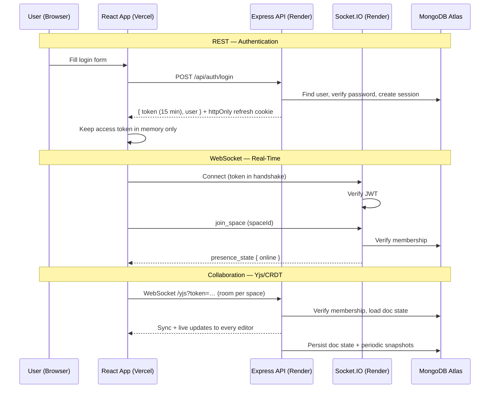
```mermaid
sequenceDiagram
    participant U as User (Browser)
    participant R as React App (Vercel)
    participant E as Express API (Render)
    participant S as Socket.IO (Render)
    participant M as MongoDB Atlas

    Note over U, M: REST — Authentication
    U->>R: Fill login form
    R->>E: POST /api/auth/login
    E->>M: Find user, verify password, create session
    E-->>R: { token (15 min), user } + httpOnly refresh cookie
    R->>R: Keep access token in memory only

    Note over U, M: WebSocket — Real-Time
    R->>S: Connect (token in handshake)
    S->>S: Verify JWT
    R->>S: join_space (spaceId)
    S->>M: Verify membership
    S-->>R: presence_state { online }

    Note over U, M: Collaboration — Yjs/CRDT
    R->>E: WebSocket /yjs?token=… (room per space)
    E->>M: Verify membership, load doc state
    E-->>R: Sync + live updates to every editor
    E->>M: Persist doc state + periodic snapshots
```

---

## Tech Stack

| Layer | Technology | Version | Purpose |
|-------|-----------|---------|---------|
| **Frontend** | React | 19 | Component UI |
| | Vite | 8 | Build tool & dev server |
| | TailwindCSS | 4 | Styling, light/dark design tokens |
| | React Router | 7 | Client-side routing |
| | Axios | 1.20 | HTTP client with silent token refresh |
| | GSAP | 3.15 | Landing page & UI animation |
| | Quill | 2 | Rich-text editor |
| | quill-cursors | 6 | Multi-user cursor display |
| | Yjs | 13.6 | CRDT for collaborative editing |
| | y-quill | 1 | Yjs ↔ Quill binding |
| | y-websocket | 3.1 | Yjs WebSocket transport (client) |
| | Socket.IO Client | 4.8 | Chat, presence, live updates |
| | react-markdown | 10 | AI answers rendered as Markdown |
| | @react-oauth/google | 0.13 | Google sign-in |
| | Lucide React · react-hot-toast · react-easy-crop | — | Icons, toasts, avatar cropping |
| **Backend** | Node.js | 20+ | Runtime |
| | Express | 5 | HTTP framework |
| | Mongoose | 9 | MongoDB ODM |
| | jsonwebtoken | 9 | Access tokens |
| | cookie-parser | 1.4 | Reads the httpOnly refresh cookie |
| | bcryptjs | 3 | Password hashing |
| | google-auth-library | 11 | Verifies Google ID tokens |
| | express-validator | 7 | Request validation |
| | express-rate-limit | 8 | Rate limiting |
| | multer | 2 | File uploads |
| | nanoid | 6 | Join code fallback |
| | Socket.IO | 4.8 | WebSocket server (rooms, presence, chat) |
| | @socket.io/redis-adapter · ioredis | 8.3 · 6 | Socket.IO events and presence through Redis |
| | ws · y-websocket | 8 · 1.5 | Yjs WebSocket server |
| | NodeMailer | 10 | Email invites (optional) |
| | @google/generative-ai | 0.24 | Gemini AI assistant |
| **Database** | MongoDB Atlas | — | Primary datastore |
| | Redis (Upstash) | — | Socket.IO adapter: pub/sub, room and presence registry |
| **Hosting** | Vercel | — | Frontend |
| | Render | — | Backend (HTTP + WebSockets) |

---

## Database Schema

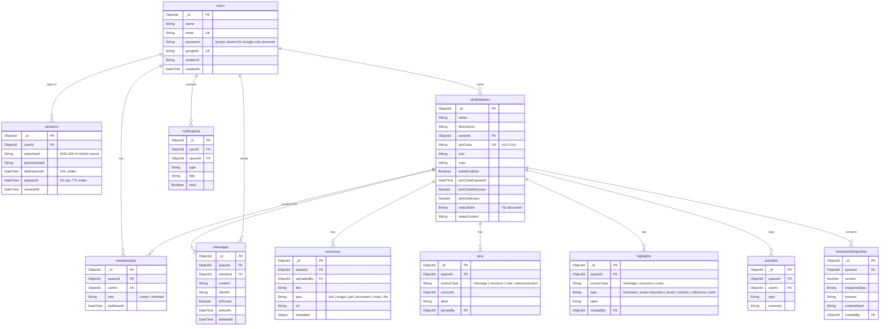
```mermaid
erDiagram
    users {
        ObjectId _id PK
        String name
        String email UK
        String password "bcrypt, absent for Google-only accounts"
        String googleId UK
        String avatarUrl
        DateTime createdAt
    }

    sessions {
        ObjectId _id PK
        ObjectId userId FK
        String tokenHash "SHA-256 of refresh secret"
        String previousHash
        DateTime idleExpiresAt "24h, slides"
        DateTime expiresAt "7d cap, TTL index"
        DateTime revokedAt
    }

    studySpaces {
        ObjectId _id PK
        String name
        String description
        ObjectId ownerId FK
        String joinCode UK "XXX-XXX"
        String icon
        String color
        Boolean inviteEnabled
        DateTime joinCodeExpiresAt
        Number joinCodeMaxUses
        Number joinCodeUses
        Binary notesState "Yjs document"
        String notesContent
    }

    memberships {
        ObjectId _id PK
        ObjectId spaceId FK
        ObjectId userId FK
        String role "owner | member"
        DateTime lastReadAt
    }

    messages {
        ObjectId _id PK
        ObjectId spaceId FK
        ObjectId senderId FK
        String content
        String clientId
        Boolean isPinned
        DateTime editedAt
        DateTime deletedAt
    }

    resources {
        ObjectId _id PK
        ObjectId spaceId FK
        ObjectId uploadedBy FK
        String title
        String type "link | image | pdf | document | code | file"
        String url
        Object metadata
    }

    pins {
        ObjectId _id PK
        ObjectId spaceId FK
        String sourceType "message | resource | note | announcement"
        ObjectId sourceId
        String label
        ObjectId pinnedBy FK
    }

    highlights {
        ObjectId _id PK
        ObjectId spaceId FK
        String sourceType "message | resource | notes"
        String type "important | exam-important | doubt | solution | reference | todo"
        String label
        ObjectId createdBy FK
    }

    activities {
        ObjectId _id PK
        ObjectId spaceId FK
        ObjectId userId FK
        String type
        String summary
    }

    documentSnapshots {
        ObjectId _id PK
        ObjectId spaceId FK
        Number version
        Binary snapshotData
        String preview
        String contentHash
        ObjectId createdBy FK
    }

    notifications {
        ObjectId _id PK
        ObjectId userId FK
        ObjectId spaceId FK
        String type
        String title
        Boolean read
    }

    users ||--o{ sessions : "signs in"
    users ||--o{ studySpaces : "owns"
    users ||--o{ memberships : "has"
    studySpaces ||--o{ memberships : "contains"
    studySpaces ||--o{ messages : "has"
    studySpaces ||--o{ resources : "has"
    studySpaces ||--o{ pins : "has"
    studySpaces ||--o{ highlights : "has"
    studySpaces ||--o{ activities : "logs"
    studySpaces ||--o{ documentSnapshots : "versions"
    users ||--o{ notifications : "receives"
    users ||--o{ messages : "sends"
```

---

## Authentication & Authorization

### Session Flow (Access + Refresh Tokens)

Logging in gives the browser two things:

- a **15-minute access token**, kept **in memory only** and sent as `Authorization: Bearer …`
- a **refresh token** in an **httpOnly cookie** (`ss_refresh`, path `/api/auth`) that page scripts can never read; the server stores only its SHA-256 hash

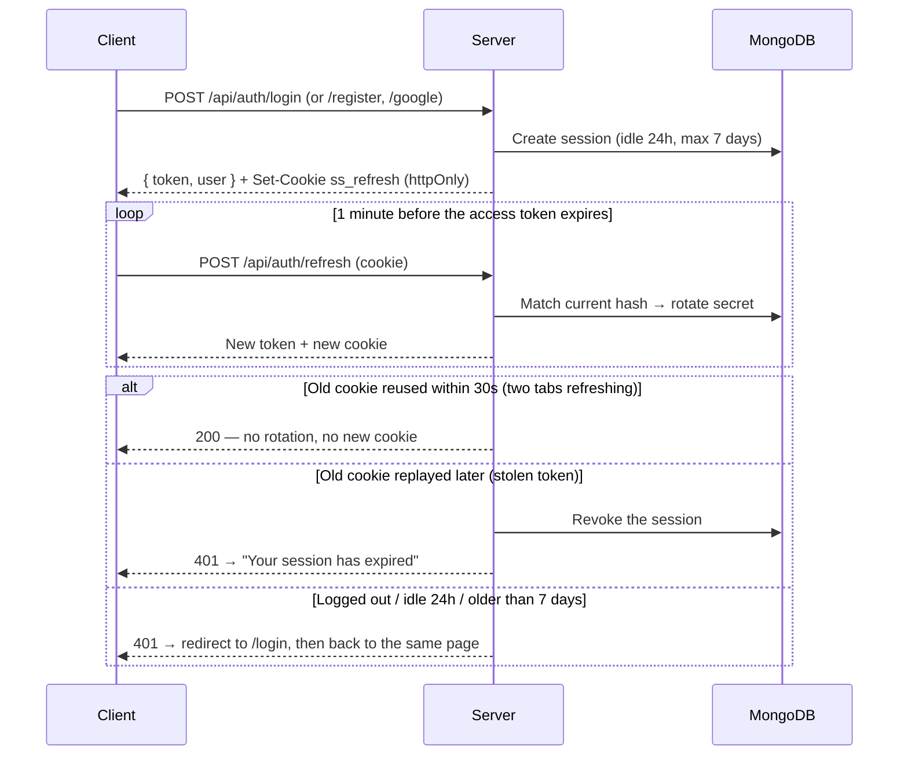
```mermaid
sequenceDiagram
    participant C as Client
    participant S as Server
    participant DB as MongoDB

    C->>S: POST /api/auth/login (or /register, /google)
    S->>DB: Create session (idle 24h, max 7 days)
    S-->>C: { token, user } + Set-Cookie ss_refresh (httpOnly)

    loop 1 minute before the access token expires
        C->>S: POST /api/auth/refresh (cookie)
        S->>DB: Match current hash → rotate secret
        S-->>C: New token + new cookie
    end

    alt Old cookie reused within 30s (two tabs refreshing)
        S-->>C: 200 — no rotation, no new cookie
    else Old cookie replayed later (stolen token)
        S->>DB: Revoke the session
        S-->>C: 401 → "Your session has expired"
    else Logged out / idle 24h / older than 7 days
        S-->>C: 401 → redirect to /login, then back to the same page
    end
```

| Rule | Behaviour |
|------|-----------|
| **Idle expiry** | Signed out after **24 hours** without the app open |
| **Absolute expiry** | Signed out **7 days** after login, however active |
| **Rotation** | Every refresh issues a new refresh token; the old one stops working |
| **Reuse detection** | A replayed old token revokes the whole session |
| **Logout** | Ends the session on the server, clears the cookie, logs out other tabs |
| **Password change** | Signs out every other device, keeps the current one |
| **Cookie flags** | `HttpOnly`; in production `Secure; SameSite=None; Partitioned` |

> **Note:** Frontend (Vercel) and backend (Render) are on different sites, so the refresh cookie is a cross-site cookie. Chrome, Edge and Firefox accept it; **Safari and Brave block it**, so users on those browsers are asked to log in again when the 15-minute token runs out.

### Permission Model (RBAC)

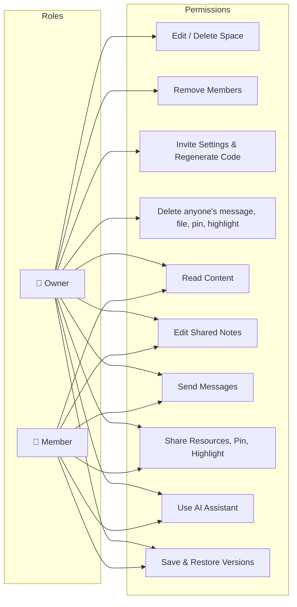
```mermaid
graph LR
    subgraph Roles
        O["👑 Owner"]
        M["👤 Member"]
    end

    subgraph Permissions
        P1["Edit / Delete Space"]
        P2["Remove Members"]
        P3["Invite Settings & Regenerate Code"]
        P4["Delete anyone's message, file, pin, highlight"]
        P5["Read Content"]
        P6["Edit Shared Notes"]
        P7["Send Messages"]
        P8["Share Resources, Pin, Highlight"]
        P9["Use AI Assistant"]
        P10["Save & Restore Versions"]
    end

    O --> P1
    O --> P2
    O --> P3
    O --> P4
    O --> P5
    O --> P6
    O --> P7
    O --> P8
    O --> P9
    O --> P10

    M --> P5
    M --> P6
    M --> P7
    M --> P8
    M --> P9
    M --> P10
```

Authorization runs **before** every controller: `protect` verifies the access token, `requireMember` loads the caller's membership, and `requireOwner` checks its role.

### WebSocket Auth Flow

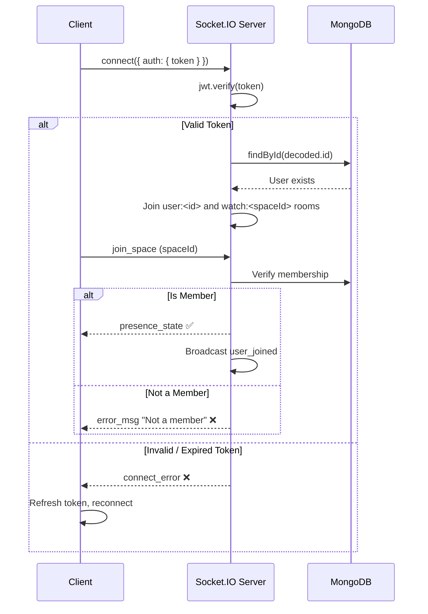
```mermaid
sequenceDiagram
    participant C as Client
    participant SIO as Socket.IO Server
    participant DB as MongoDB

    C->>SIO: connect({ auth: { token } })
    SIO->>SIO: jwt.verify(token)

    alt Valid Token
        SIO->>DB: findById(decoded.id)
        DB-->>SIO: User exists
        SIO->>SIO: Join user:<id> and watch:<spaceId> rooms
        C->>SIO: join_space (spaceId)
        SIO->>DB: Verify membership
        alt Is Member
            SIO-->>C: presence_state ✅
            SIO->>SIO: Broadcast user_joined
        else Not a Member
            SIO-->>C: error_msg "Not a member" ❌
        end
    else Invalid / Expired Token
        SIO-->>C: connect_error ❌
        C->>C: Refresh token, reconnect
    end
```

### Rate Limits

| Limiter | Routes | Limit |
|---------|--------|-------|
| `authLimiter` | register, login, google | 20 / 15 min per IP |
| `refreshLimiter` | refresh, logout | 60 / 15 min per IP |
| `apiLimiter` | spaces, search, notifications | 200 / 15 min per IP |
| `uploadLimiter` | resource uploads | 30 / 15 min per IP |
| `aiLimiter` | AI assistant | 30 / 15 min per user |
| `emailLimiter` | invite emails | 15 / hour per user |

---

## API Reference

> **Legend:** Public · 🍪 Refresh cookie · 🔒 JWT (access token) · 👥 Member · 👑 Owner

### Auth Routes

| Method | Endpoint | Auth | Description |
|--------|----------|------|-------------|
| `POST` | `/api/auth/register` | Public | Register new user |
| `POST` | `/api/auth/login` | Public | Login with email + password |
| `POST` | `/api/auth/google` | Public | Sign in with a Google ID token |
| `POST` | `/api/auth/refresh` | 🍪 | Rotate the refresh cookie, get a new 15-min access token |
| `POST` | `/api/auth/logout` | 🍪 | End this browser's session and clear the cookie |
| `GET` | `/api/auth/me` | 🔒 | Get current user profile |
| `PATCH` | `/api/auth/profile` | 🔒 | Update name |
| `PATCH` | `/api/auth/password` | 🔒 | Change password (signs out other devices) |
| `POST` | `/api/auth/avatar` | 🔒 | Upload profile picture |

**Register Request:**
```json
{
  "name": "Priyansh",
  "email": "priyansh@example.com",
  "password": "securePassword123"
}
```

> **Validation Rules:** Name 2–50 chars, valid email, password ≥ 6 chars with at least one number.

**Auth Response** (plus `Set-Cookie: ss_refresh=…; HttpOnly; Path=/api/auth`):
```json
{
  "success": true,
  "token": "eyJhbGciOiJIUzI1NiIs...",
  "user": {
    "id": "66f1a2b3c4d5e6f7a8b9c0d1",
    "name": "Priyansh",
    "email": "priyansh@example.com",
    "avatarUrl": "https://ui-avatars.com/api/?name=Priyansh",
    "createdAt": "2026-09-24T02:00:00.000Z"
  }
}
```

---

### Study Space Routes

> All space routes require the access token and are rate limited (200 req/15min via `apiLimiter`).
> Join codes are `XXX-XXX` (6 characters, no look-alike `O/0/I/1/L`).

| Method | Endpoint | Auth | Description |
|--------|----------|------|-------------|
| `POST` | `/api/spaces` | 🔒 | Create a study space (name, description, icon, colour) |
| `GET` | `/api/spaces` | 🔒 | List my spaces with member count, role and unread count |
| `POST` | `/api/spaces/join` | 🔒 | Join via code (any case, dash optional) |
| `GET` | `/api/spaces/invite/:code` | 🔒 | Preview a space before joining |
| `GET` | `/api/spaces/:id` | 👥 | Get space details |
| `PATCH` | `/api/spaces/:id` | 👑 | Update name, description, icon, colour |
| `DELETE` | `/api/spaces/:id` | 👑 | Delete the space and everything in it |
| `PATCH` | `/api/spaces/:id/notes` | 👥 | Save the notes' HTML copy |

**Create Space Request:**
```json
{
  "name": "CS101 Study Group",
  "description": "Preparing for midterms",
  "icon": "code",
  "color": "#6366f1"
}
```

**Create Space Response:**
```json
{
  "success": true,
  "space": {
    "_id": "66f1a2b3c4d5e6f7a8b9c0d1",
    "name": "CS101 Study Group",
    "description": "Preparing for midterms",
    "joinCode": "7KQ-9PM",
    "inviteEnabled": true,
    "membersCount": 1,
    "userRole": "owner"
  }
}
```

**Join Space Request:**
```json
{ "code": "7KQ-9PM" }
```

---

### Member & Invite Routes

| Method | Endpoint | Auth | Description |
|--------|----------|------|-------------|
| `GET` | `/api/spaces/:spaceId/members` | 👥 | List members |
| `POST` | `/api/spaces/:spaceId/leave` | 👥 | Leave the space (not the owner) |
| `DELETE` | `/api/spaces/:spaceId/members/:userId` | 👑 | Remove a member |
| `GET` | `/api/spaces/:spaceId/invites` | 👥 | Invite link, code, limits and usage |
| `POST` | `/api/spaces/:spaceId/invites` | 👑 | Update invite settings |
| `POST` | `/api/spaces/:spaceId/invites/regenerate` | 👑 | Generate a new code (old link stops working) |
| `POST` | `/api/spaces/:spaceId/invites/email` | 👥 | Send email invitations |

**Update Invite Settings Request:**
```json
{
  "inviteEnabled": true,
  "expiresInDays": 14,
  "maxUses": 12
}
```

> `expiresInDays`: 1–365 or `null` (never) · `maxUses`: 1–1000 or `null` (unlimited)

---

### Message Routes

> New messages are sent over **Socket.IO** (`send_message`) so they appear instantly. REST covers history, edits and read state.

| Method | Endpoint | Auth | Description |
|--------|----------|------|-------------|
| `GET` | `/api/spaces/:spaceId/messages` | 👥 | Message history (paged) |
| `POST` | `/api/spaces/:spaceId/read` | 👥 | Mark the discussion as read |
| `PATCH` | `/api/spaces/:spaceId/messages/:messageId` | Sender | Edit own message |
| `DELETE` | `/api/spaces/:spaceId/messages/:messageId` | Sender / 👑 | Delete message |

---

### Resource Routes

| Method | Endpoint | Auth | Description |
|--------|----------|------|-------------|
| `GET` | `/api/spaces/:spaceId/resources` | 👥 | List resources |
| `POST` | `/api/spaces/:spaceId/resources` | 👥 | Add a link, snippet or upload a file (≤ 10 MB) |
| `DELETE` | `/api/spaces/:spaceId/resources/:resourceId` | Uploader / 👑 | Delete resource |

---

### Pin & Highlight Routes

| Method | Endpoint | Auth | Description |
|--------|----------|------|-------------|
| `GET` | `/api/spaces/:spaceId/pins` | 👥 | List pins |
| `POST` | `/api/spaces/:spaceId/pins` | 👥 | Pin a message, resource, note or announcement |
| `DELETE` | `/api/spaces/:spaceId/pins/:pinId` | Pinner / 👑 | Unpin |
| `GET` | `/api/spaces/:spaceId/highlights` | 👥 | List highlights |
| `POST` | `/api/spaces/:spaceId/highlights` | 👥 | Highlight content |
| `DELETE` | `/api/spaces/:spaceId/highlights/:highlightId` | Creator / 👑 | Remove highlight |

---

### Activity, Versions, AI, Search & Notifications

| Method | Endpoint | Auth | Description |
|--------|----------|------|-------------|
| `GET` | `/api/spaces/:spaceId/activity` | 👥 | Activity feed |
| `GET` | `/api/spaces/:spaceId/versions` | 👥 | List note versions |
| `GET` | `/api/spaces/:spaceId/versions/:version` | 👥 | Get one version |
| `POST` | `/api/spaces/:spaceId/versions/save` | 👥 | Save a version now (only if notes changed) |
| `POST` | `/api/spaces/:spaceId/versions/:version/restore` | 👥 | Restore a version |
| `POST` | `/api/spaces/:spaceId/ai/ask` | 👥 | Ask about the space's notes |
| `POST` | `/api/spaces/:spaceId/ai/summarize` | 👥 | Summarise the discussion |
| `POST` | `/api/spaces/:spaceId/ai/quiz` | 👥 | Generate a 5-question quiz |
| `POST` | `/api/spaces/:spaceId/ai/explain` | 👥 | Explain selected text |
| `POST` | `/api/spaces/:spaceId/ai/revision-notes` | 👥 | Generate revision notes |
| `GET` | `/api/search?q=…` | 🔒 | Search across all my spaces |
| `GET` | `/api/notifications` | 🔒 | List notifications + unread count |
| `PATCH` | `/api/notifications/read-all` | 🔒 | Mark all read |
| `PATCH` | `/api/notifications/:id/read` | 🔒 | Mark one read |
| `DELETE` | `/api/notifications/:id` | 🔒 | Dismiss |
| `GET` | `/api/health` | Public | Health check |

---

## WebSocket Events

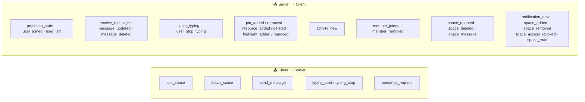
```mermaid
graph LR
    subgraph Client_Events["📤 Client → Server"]
        CE1["join_space"]
        CE2["leave_space"]
        CE3["send_message"]
        CE4["typing_start / typing_stop"]
        CE5["presence_request"]
    end

    subgraph Server_Events["📥 Server → Client"]
        SE1["presence_state · user_joined · user_left"]
        SE2["receive_message · message_updated · message_deleted"]
        SE3["user_typing · user_stop_typing"]
        SE4["pin_added / removed · resource_added / deleted · highlight_added / removed"]
        SE5["activity_new"]
        SE6["member_joined · member_removed"]
        SE7["space_updated · space_deleted · space_message"]
        SE8["notification_new · space_added · space_removed<br/>space_access_revoked · space_read"]
    end
```

| Event | Direction | Room | Description |
|-------|-----------|------|-------------|
| `connection` | Client → Server | — | Handshake with `{ auth: { token } }` |
| `join_space` / `leave_space` | Client → Server | — | Enter or leave a space's room |
| `presence_request` | Client → Server | — | Ask for the current online list |
| `send_message` | Client → Server | — | `{ spaceId, content, clientId }`, ack returns the saved message |
| `typing_start` / `typing_stop` | Client → Server | — | Typing indicator |
| `presence_state` | Server → Client | `space:` | Who is online |
| `user_joined` / `user_left` | Server → Client | `space:` | Someone opened / closed the space |
| `receive_message` | Server → Client | `space:` | New chat message |
| `message_updated` / `message_deleted` | Server → Client | `space:` | Message edited / deleted |
| `user_typing` / `user_stop_typing` | Server → Client | `space:` | Typing indicator |
| `pin_added` / `pin_removed` | Server → Client | `space:` | Pins changed |
| `resource_added` / `resource_deleted` | Server → Client | `space:` | Resources changed |
| `highlight_added` / `highlight_removed` | Server → Client | `space:` | Highlights changed |
| `activity_new` | Server → Client | `space:` | New activity entry |
| `member_joined` / `member_removed` | Server → Client | `space:` + `watch:` | Member list and count changed |
| `space_updated` | Server → Client | `space:` + `watch:` | Name, icon, colour, code or invite state changed |
| `space_deleted` | Server → Client | `space:` + `watch:` | Owner deleted the space |
| `space_message` | Server → Client | `watch:` | New message (for dashboard unread counts) |
| `notification_new` | Server → Client | `user:` | In-app notification |
| `space_added` / `space_removed` | Server → Client | `user:` | You joined / left a space in another tab |
| `space_access_revoked` | Server → Client | `user:` | You were removed from a space |
| `space_read` | Server → Client | `user:` | You read the chat in another tab |

---

## Real-Time Collaboration (CRDT)

### Why Yjs / CRDT?

A naive approach of broadcasting editor state causes **conflicts** when users edit concurrently:

```
Client A types "Hello" → Server → Client B
Client B types "World" → Server → Client A
❌ Result: One edit overwrites the other
```

Kolo uses **Yjs** (a CRDT library) so that document changes are represented as collaborative operations and all replicas converge automatically.

### Collaboration Architecture

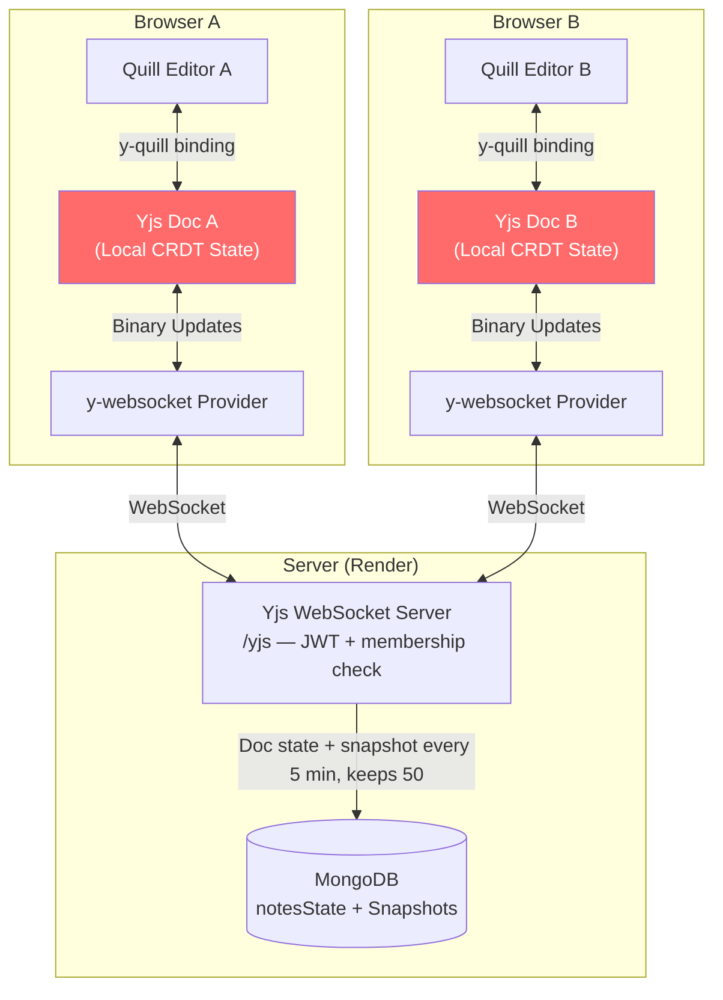
```mermaid
graph TB
    subgraph Browser_A["Browser A"]
        QA["Quill Editor A"]
        YA["Yjs Doc A<br/>(Local CRDT State)"]
        WA["y-websocket Provider"]
    end

    subgraph Browser_B["Browser B"]
        QB["Quill Editor B"]
        YB["Yjs Doc B<br/>(Local CRDT State)"]
        WB["y-websocket Provider"]
    end

    subgraph Server_Layer["Server (Render)"]
        YWS["Yjs WebSocket Server<br/>/yjs — JWT + membership check"]
        MONGO_S[(MongoDB<br/>notesState + Snapshots)]
    end

    QA <-->|y-quill binding| YA
    YA <-->|Binary Updates| WA
    WA <-->|WebSocket| YWS

    QB <-->|y-quill binding| YB
    YB <-->|Binary Updates| WB
    WB <-->|WebSocket| YWS

    YWS -->|Doc state + snapshot every 5 min, keeps 50| MONGO_S

    style YA fill:#ff6b6b,color:#fff
    style YB fill:#ff6b6b,color:#fff
```

### CRDT Convergence Flow

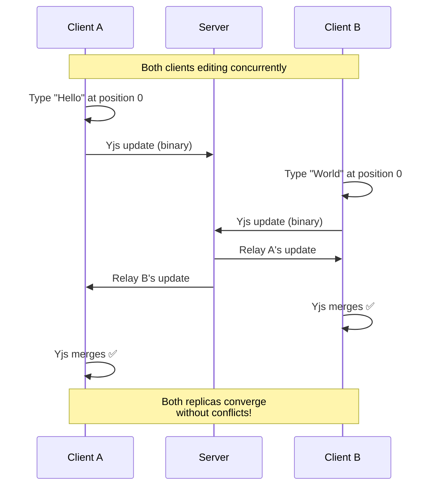
```mermaid
sequenceDiagram
    participant A as Client A
    participant S as Server
    participant B as Client B

    Note over A, B: Both clients editing concurrently

    A->>A: Type "Hello" at position 0
    A->>S: Yjs update (binary)
    B->>B: Type "World" at position 0
    B->>S: Yjs update (binary)

    S->>B: Relay A's update
    S->>A: Relay B's update

    B->>B: Yjs merges ✅
    A->>A: Yjs merges ✅

    Note over A, B: Both replicas converge<br/>without conflicts!
```

### Reconnection Handling

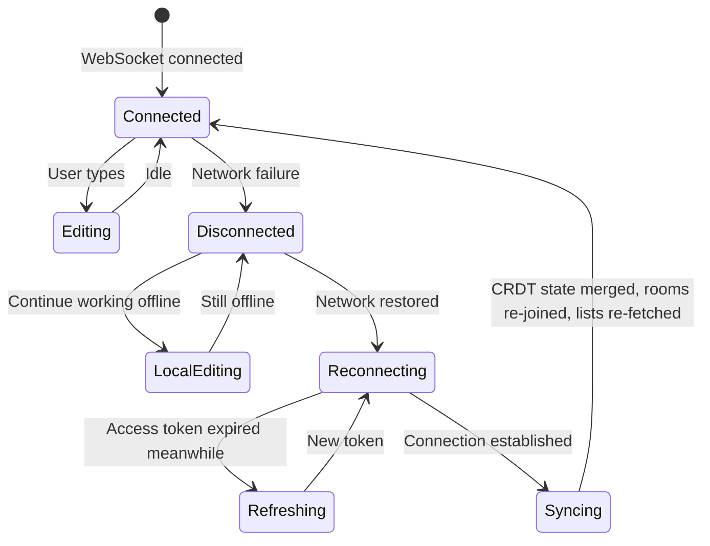
```mermaid
stateDiagram-v2
    [*] --> Connected: WebSocket connected

    Connected --> Editing: User types
    Editing --> Connected: Idle

    Connected --> Disconnected: Network failure

    Disconnected --> LocalEditing: Continue working offline
    LocalEditing --> Disconnected: Still offline

    Disconnected --> Reconnecting: Network restored
    Reconnecting --> Refreshing: Access token expired meanwhile
    Refreshing --> Reconnecting: New token
    Reconnecting --> Syncing: Connection established
    Syncing --> Connected: CRDT state merged, rooms re-joined, lists re-fetched
```

---

## Live Updates

Every member's open tabs — **including the dashboard** — update without a refresh.

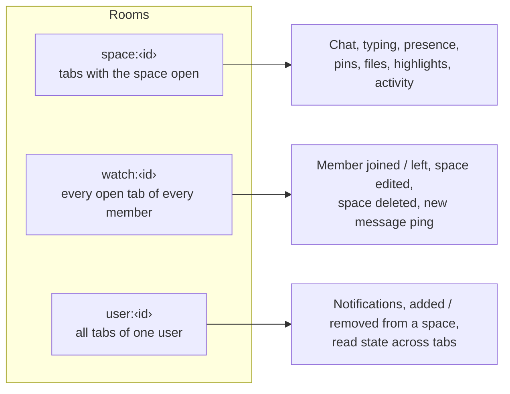
```mermaid
graph LR
    subgraph Rooms
        SP["space:‹id›<br/>tabs with the space open"]
        WA["watch:‹id›<br/>every open tab of every member"]
        US["user:‹id›<br/>all tabs of one user"]
    end

    SP --> E1["Chat, typing, presence,<br/>pins, files, highlights, activity"]
    WA --> E2["Member joined / left, space edited,<br/>space deleted, new message ping"]
    US --> E3["Notifications, added / removed from a space,<br/>read state across tabs"]
```

| When… | …this updates live |
|-------|--------------------|
| Someone joins | Member count on dashboard cards and space header, member list, "X joined" toast |
| Someone leaves / is removed | Count and member list; the card disappears from their dashboard |
| Owner edits the space | Name, description, icon and colour on cards and header |
| A new message is sent | Unread badge on dashboard cards |
| You read the chat | Unread badge clears in your other tabs |
| You create / join a space | It appears in your other tabs |
| Owner deletes the space | Card disappears for everyone, with a notice |
| Invite code regenerated | Code in the space header |

A socket joins the `watch:` room of **every** space its user belongs to on connect, and is added/removed as people join and leave. After a reconnect, the dashboard and workspace re-fetch their data so nothing missed while offline stays missing.

---

## Invite & Join System

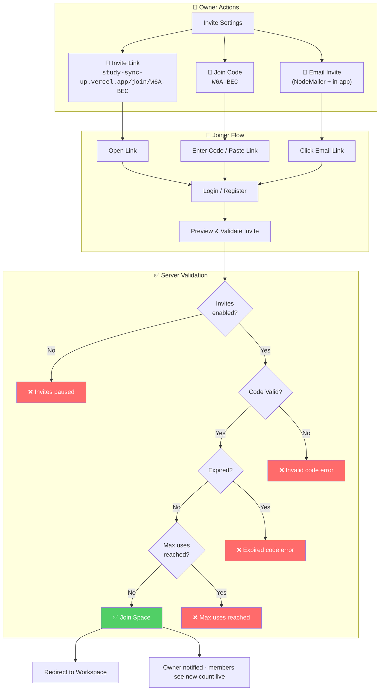
```mermaid
flowchart TD
    subgraph Owner_Actions["👑 Owner Actions"]
        G["Invite Settings"]
        G --> IL["📎 Invite Link<br/><code>study-sync-up.vercel.app/join/W6A-BEC</code>"]
        G --> IC["🔢 Join Code<br/><code>W6A-BEC</code>"]
        G --> EM["📧 Email Invite<br/>(NodeMailer + in-app)"]
    end

    subgraph Joiner_Flow["👤 Joiner Flow"]
        IL --> OA["Open Link"]
        IC --> EC["Enter Code / Paste Link"]
        EM --> CL["Click Email Link"]

        OA --> LI["Login / Register"]
        EC --> LI
        CL --> LI

        LI --> VL["Preview & Validate Invite"]
    end

    subgraph Validation["✅ Server Validation"]
        VL --> EN{"Invites<br/>enabled?"}
        EN -->|No| ERR0["❌ Invites paused"]
        EN -->|Yes| CK{"Code Valid?"}
        CK -->|Yes| EX{"Expired?"}
        CK -->|No| ERR["❌ Invalid code error"]
        EX -->|No| MC{"Max uses<br/>reached?"}
        EX -->|Yes| ERR2["❌ Expired code error"]
        MC -->|No| JOIN["✅ Join Space"]
        MC -->|Yes| ERR3["❌ Max uses reached"]
    end

    JOIN --> WS["Redirect to Workspace"]
    JOIN --> LIVE["Owner notified · members see new count live"]

    style JOIN fill:#51cf66,color:#fff
    style ERR0 fill:#ff6b6b,color:#fff
    style ERR fill:#ff6b6b,color:#fff
    style ERR2 fill:#ff6b6b,color:#fff
    style ERR3 fill:#ff6b6b,color:#fff
```

| Setting | Options |
|---------|---------|
| **Allow people to join** | On / Off (pauses link and code without changing them) |
| **Expires in** | Never · 1 day · 7 days · 30 days · **Custom (1–365 days)** |
| **Max people who can join** | Unlimited · 1 · 5 · 10 · 25 · **Custom (1–1000)** |
| **Regenerate** | New code; the old link stops working |

> **Note:** Links use the code as shown (`/join/W6A-BEC`). `w6abec`, `W6ABEC` and a pasted full link also work — the join page tidies the address to `W6A-BEC`.

---

## AI Study Assistant

Powered by **Google Gemini** (Flash, with a Flash-Lite fallback when the main model is busy).

| Mode | What it does | Based on |
|------|-------------|----------|
| 💬 **Ask** | Answers questions about the space | Shared notes (general answers are labelled) |
| 🧾 **Summarize** | Summarises the discussion | Recent chat messages |
| 🧠 **Quiz** | 5-question multiple-choice quiz | Shared notes |
| 💡 **Explain** | Explains a selection from the notes | Selected text + surrounding notes |
| 📚 **Revision Notes** | Turns notes into a revision sheet | Shared notes |

> **Note:** Content from the space is passed to the model as material, not instructions. Each user gets 30 AI requests per 15 minutes, and every request has a timeout.

---

## Interface — Themes & Layouts

### Themes

**Light · System · Dark** — chosen from the top bar (or the account menu on phones) and remembered per browser. The app screens use the same design tokens as the landing page: neutral zinc greys, a single orange accent, **Geist** for text and **Instrument Serif** for headings.

### Responsive Layouts (inside a space)

| Screen | Width | Layout |
|--------|-------|--------|
| 📱 Phone | < 768 px | Scrolling tab strip, chat is a tab |
| 📱 Phone (landscape) | short height | Top bar hidden to save space |
| 📲 Tablet (portrait) | 768–1023 px | Icon rail, chat slides over from the right |
| 📲 Tablet (landscape) | 1024–1279 px | Icon rail, chat docked |
| 🖥️ Desktop | ≥ 1280 px | Labelled sidebar, wide chat column |

Touch screens always show the actions that appear on hover with a mouse (message menu, unpin, delete).

---

## User Journeys

### User Journey — Create & Collaborate

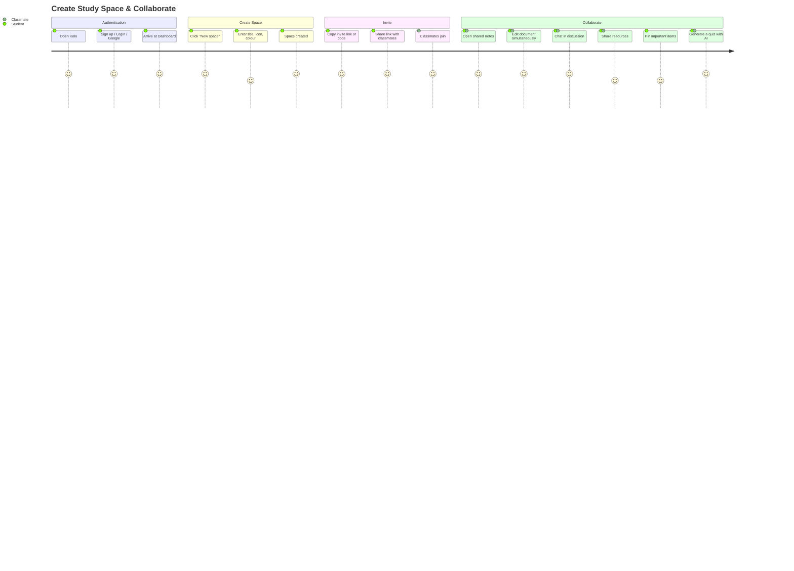
```mermaid
journey
    title Create Study Space & Collaborate
    section Authentication
      Open Kolo: 5: Student
      Sign up / Login / Google: 5: Student
      Arrive at Dashboard: 5: Student
    section Create Space
      Click "New space": 5: Student
      Enter title, icon, colour: 4: Student
      Space created: 5: Student
    section Invite
      Copy invite link or code: 5: Student
      Share link with classmates: 5: Student
      Classmates join: 5: Classmate
    section Collaborate
      Open shared notes: 5: Student, Classmate
      Edit document simultaneously: 5: Student, Classmate
      Chat in discussion: 5: Student, Classmate
      Share resources: 4: Student, Classmate
      Pin important items: 4: Student
      Generate a quiz with AI: 5: Student, Classmate
```

### User Journey — Late Joiner

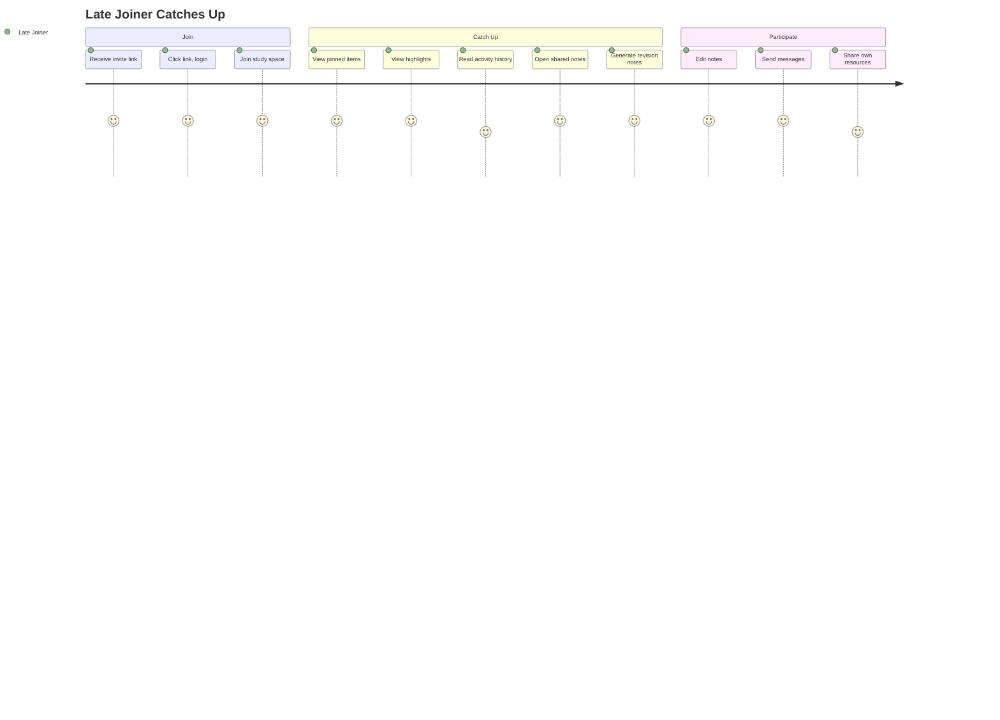
```mermaid
journey
    title Late Joiner Catches Up
    section Join
      Receive invite link: 5: Late Joiner
      Click link, login: 5: Late Joiner
      Join study space: 5: Late Joiner
    section Catch Up
      View pinned items: 5: Late Joiner
      View highlights: 5: Late Joiner
      Read activity history: 4: Late Joiner
      Open shared notes: 5: Late Joiner
      Generate revision notes: 5: Late Joiner
    section Participate
      Edit notes: 5: Late Joiner
      Send messages: 5: Late Joiner
      Share own resources: 4: Late Joiner
```

### User Journey — Share & Preserve Solutions

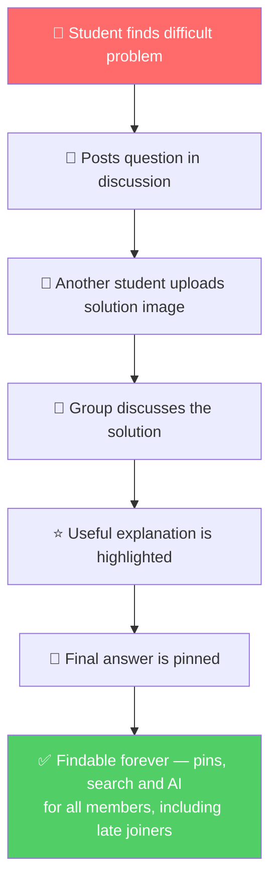
```mermaid
flowchart TD
    A["🤔 Student finds difficult problem"] --> B["📝 Posts question in discussion"]
    B --> C["📸 Another student uploads solution image"]
    C --> D["💬 Group discusses the solution"]
    D --> E["⭐ Useful explanation is highlighted"]
    E --> F["📌 Final answer is pinned"]
    F --> G["✅ Findable forever — pins, search and AI<br/>for all members, including late joiners"]

    style A fill:#ff6b6b,color:#fff
    style G fill:#51cf66,color:#fff
```

---

## Redis & Horizontal Scaling

Kolo runs **Redis (Upstash)** in production, even with a single Render server. The **Socket.IO Redis Adapter** is switched on whenever `REDIS_URL` is set, so every room broadcast and every presence lookup goes through Redis.

### Current Setup — Single Server + Redis (Render + Upstash)

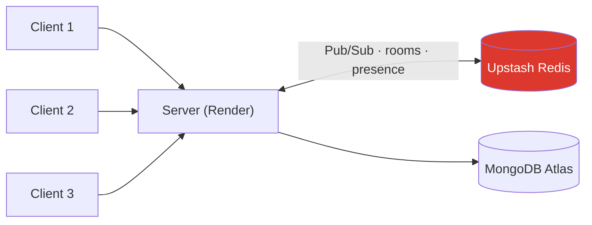
```mermaid
graph LR
    C1["Client 1"] --> S["Server (Render)"]
    C2["Client 2"] --> S
    C3["Client 3"] --> S

    S <-->|Pub/Sub · rooms · presence| REDIS[(Upstash Redis)]
    S --> M[(MongoDB Atlas)]

    style REDIS fill:#DC382D,color:#fff
```

| What Redis does | How |
|-----------------|-----|
| **Event delivery** | Emits to `space:`, `watch:` and `user:` rooms are published through Redis and delivered to the right sockets |
| **Presence** | "Who is online" (`fetchSockets()` on a room) is answered through the adapter, not a local in-memory map |
| **Ready to scale** | A second server instance can be added without code changes — it sees the same rooms and presence |
| **Secure connection** | `rediss://` (TLS) with separate pub and sub clients, automatic retry with back-off |

### Scaling Out — Multiple Servers with Redis

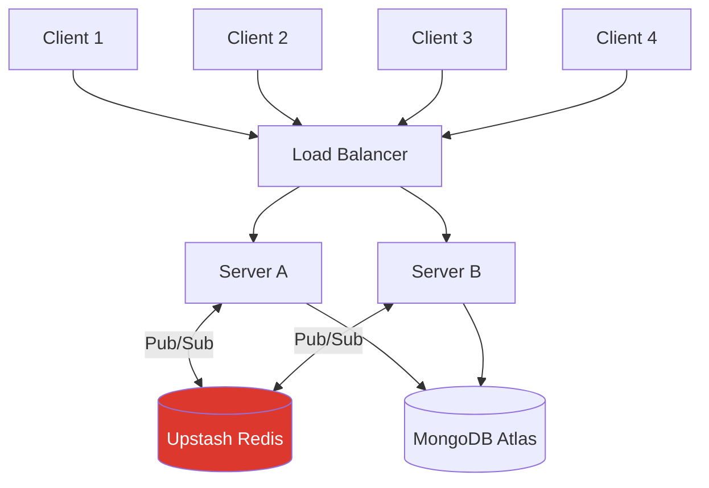
```mermaid
graph TB
    C1["Client 1"] --> LB["Load Balancer"]
    C2["Client 2"] --> LB
    C3["Client 3"] --> LB
    C4["Client 4"] --> LB

    LB --> S1["Server A"]
    LB --> S2["Server B"]

    S1 <-->|Pub/Sub| REDIS[(Upstash Redis)]
    S2 <-->|Pub/Sub| REDIS

    S1 --> MONGO[(MongoDB Atlas)]
    S2 --> MONGO

    style REDIS fill:#DC382D,color:#fff
```

Without Redis, Server A and Server B cannot relay Socket.IO events to each other's connected clients. The **Socket.IO Redis Adapter** solves this by publishing events to Redis, where all server instances subscribe.

> **Note:** For local development `REDIS_URL` can be left empty — the server then falls back to Socket.IO's in-memory adapter and everything still works on one machine.

---

## Getting Started

### Prerequisites

| Requirement | Version |
|-------------|---------|
| Node.js | 20+ |
| npm | 10+ |
| MongoDB | 7+ (or MongoDB Atlas) |
| Redis | Upstash (or local Redis 7+; optional for local development) |
| Git | Latest |

### Installation

```bash
# Clone the repository
git clone <repository-url>
cd studysync

# Install server dependencies
cd server
npm install

# Install client dependencies
cd ../client
npm install
```

### Environment Variables

Create `server/.env`:

```env
# Server
PORT=5000
NODE_ENV=development
CLIENT_URL=http://localhost:5173        # CORS + invite links (comma-separate several)
SERVER_URL=                             # Production only: Render self-ping URL

# MongoDB
MONGO_URI=mongodb://localhost:27017/studysync

# JWT and sessions
JWT_SECRET=your_super_secret_jwt_key_change_in_production
JWT_ACCESS_EXPIRE=15m                   # Access token lifetime
SESSION_IDLE_HOURS=24                   # Signed out after this long without using the app
SESSION_MAX_DAYS=7                      # Signed out this long after logging in, however active

# Google sign-in (optional)
GOOGLE_CLIENT_ID=

# AI assistant (optional)
GEMINI_API_KEY=
# GEMINI_MODEL=gemini-3.5-flash
# GEMINI_FALLBACK_MODEL=gemini-3.5-flash-lite

# Redis — Socket.IO adapter (used in production with Upstash; leave empty locally to use in-memory rooms)
REDIS_URL=rediss://default:<password>@<your-db>.upstash.io:6379

# Email invites (optional — in-app invites work without it)
# SMTP_HOST=smtp.gmail.com
# SMTP_PORT=587
# SMTP_USER=your-email@gmail.com
# SMTP_PASS=your-app-password

# Limits (optional)
# MAX_UPLOAD_MB=10
# SNAPSHOT_INTERVAL_MS=300000
# MAX_SNAPSHOTS=50
```

Create `client/.env`:

```env
VITE_API_URL=http://localhost:5000/api
VITE_GOOGLE_CLIENT_ID=                  # Same client id as the server
```

### Running Locally

```bash
# Terminal 1 — Start the backend
cd server
npm run dev          # Uses nodemon for hot-reload

# Terminal 2 — Start the frontend
cd client
npm run dev          # Vite dev server at http://localhost:5173
```

| Service | URL |
|---------|-----|
| Frontend | `http://localhost:5173` |
| Backend API | `http://localhost:5000` |
| Health Check | `http://localhost:5000/api/health` |

### Seed Database

```bash
cd server
node scripts/seed.js
# Creates a test user: test@studysync.com / password123
```

---

## Deployment

Kolo is live with the **frontend on Vercel** and the **backend on Render**.

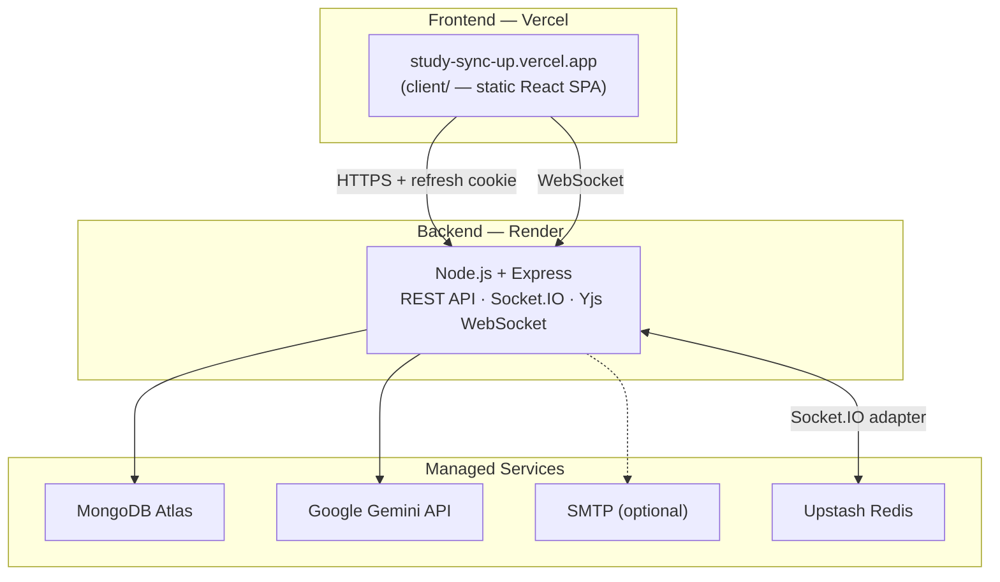
```mermaid
graph TB
    subgraph Frontend["Frontend — Vercel"]
        V["study-sync-up.vercel.app<br/>(client/ — static React SPA)"]
    end

    subgraph Backend["Backend — Render"]
        R["Node.js + Express<br/>REST API · Socket.IO · Yjs WebSocket"]
    end

    subgraph Services["Managed Services"]
        MA["MongoDB Atlas"]
        GE["Google Gemini API"]
        SM["SMTP (optional)"]
        UP["Upstash Redis"]
    end

    V -->|HTTPS + refresh cookie| R
    V -->|WebSocket| R
    R --> MA
    R --> GE
    R -.-> SM
    R <-->|Socket.IO adapter| UP
```

| Component | Platform | Configuration |
|-----------|----------|---------------|
| **Frontend** | **Vercel** | Root directory `client/`. `vercel.json` rewrites every path to `index.html`, so refreshing any page and `/join/…` links work. Env: `VITE_API_URL` (Render URL + `/api`), `VITE_GOOGLE_CLIENT_ID`. |
| **Backend** | **Render** | Root directory `server/`, start `npm start`. Env: `NODE_ENV=production`, `CLIENT_URL=https://study-sync-up.vercel.app` (exactly — used for CORS and invite links), `SERVER_URL` (for the self-ping), plus the variables above. |
| **Database** | **MongoDB Atlas** | Allow Render's outbound IPs in Network Access. |
| **Redis** | **Upstash** | `REDIS_URL` (`rediss://…`) on Render — powers the Socket.IO Redis adapter. |
| **AI** | Google Gemini | `GEMINI_API_KEY` on Render. |

> ⚠️ **Important:** Render's free tier sleeps after inactivity. The server pings its own `/api/health` every 5 minutes (when `NODE_ENV=production` and `SERVER_URL` are set) to stay awake; if it does sleep, the first request can take up to a minute.

> ⚠️ **Important:** The backend host must support **persistent WebSocket connections** — the notes, chat and live updates all depend on them. Render does; serverless hosting does not.

---

## Testing

| Category | Method | What is covered |
|----------|--------|-----------------|
| **Sessions** | Scripted HTTP tests against a test server + temporary database | Rotation, two-tab race window, reuse detection, access-token expiry, logout, idle & max age, password change, cookie flags — **24/24 passing** |
| **Live updates** | Two users with two real Socket.IO connections | Join/leave counts, rename, message pings, read sync, removal, delete delivered once, invite codes in any case — **17/17 passing** |
| **UI** | Browser checks at phone, tablet (both orientations) and desktop sizes, light and dark | Dashboard, workspace, chat drawer, modals, search, profile, join |
| **Build** | `npm run build` in `client/` | Every change |

### Critical Test Scenarios

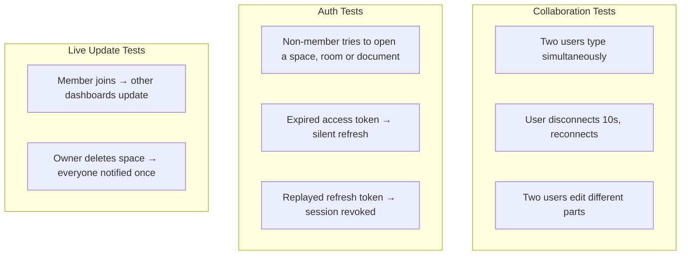
```mermaid
graph TD
    subgraph Collab["Collaboration Tests"]
        T1["Two users type simultaneously"]
        T2["User disconnects 10s, reconnects"]
        T3["Two users edit different parts"]
    end

    subgraph Auth_Tests["Auth Tests"]
        T4["Non-member tries to open a space, room or document"]
        T5["Expired access token → silent refresh"]
        T6["Replayed refresh token → session revoked"]
    end

    subgraph Live_Tests["Live Update Tests"]
        T7["Member joins → other dashboards update"]
        T8["Owner deletes space → everyone notified once"]
    end
```

---

## Contributing

1. Fork the repository
2. Create a feature branch: `git checkout -b feature/amazing-feature`
3. Commit your changes: `git commit -m 'feat: add amazing feature'`
4. Push to the branch: `git push origin feature/amazing-feature`
5. Open a Pull Request

### Commit Convention

| Prefix | Usage |
|--------|-------|
| `feat:` | New feature |
| `fix:` | Bug fix |
| `docs:` | Documentation |
| `style:` | Code style (no logic change) |
| `refactor:` | Code restructure |
| `test:` | Tests |
| `chore:` | Build/config changes |

---

## License

This project is developed as part of the **Full Stack Development** course (Semester 5, B.Tech) as an innovative assignment.

---

<p align="center">
  <b>Built with ❤️ by Priyansh Patel & Kaivalya Bhatt</b><br/>
  <i>"Don't build another generic notes app. Build a shared digital study room."</i>
</p>
