<p align="center">
  
</p>

<h1 align="center">📚 StudySync</h1>

<p align="center">
  <b>Real-Time Collaborative Study Workspace</b><br/>
  <i>Create a study space → Invite classmates → Collaborate live → Capture knowledge → Revisit later</i>
</p>

<p align="center">
  
  
  
  
  
  
  
</p>

---

## Table of Contents

- [Overview](#overview)
- [Problem Statement](#problem-statement)
- [Product Vision](#product-vision)
- [Architecture](#architecture)
  - [High-Level Architecture](#high-level-architecture)
  - [Directory Structure](#directory-structure)
  - [Data Flow](#data-flow)
- [Tech Stack](#tech-stack)
- [Database Schema](#database-schema)
- [Authentication & Authorization](#authentication--authorization)
  - [JWT Auth Flow](#jwt-auth-flow)
  - [WebSocket Auth Flow](#websocket-auth-flow)
- [API Reference](#api-reference)
  - [Auth Routes](#auth-routes)
  - [Study Space Routes](#study-space-routes)
  - [Invite Routes](#invite-routes)
  - [Message Routes](#message-routes)
  - [Resource Routes](#resource-routes)
  - [Pin & Highlight Routes](#pin--highlight-routes)
- [WebSocket Events](#websocket-events)
- [Real-Time Collaboration (CRDT)](#real-time-collaboration-crdt)
- [User Journeys](#user-journeys)
  - [Create & Collaborate](#user-journey--create--collaborate)
  - [Late Joiner](#user-journey--late-joiner)
  - [Share & Preserve Solutions](#user-journey--share--preserve-solutions)
- [Invite & Join System](#invite--join-system)
- [Redis & Horizontal Scaling](#redis--horizontal-scaling)
- [Getting Started](#getting-started)
  - [Prerequisites](#prerequisites)
  - [Installation](#installation)
  - [Environment Variables](#environment-variables)
  - [Running Locally](#running-locally)
- [Development Roadmap](#development-roadmap)
- [Deployment](#deployment)
- [Testing Strategy](#testing-strategy)
- [Contributing](#contributing)
- [License](#license)

---

## Overview

**StudySync** is a real-time collaborative study workspace where students create shared spaces, invite peers, jointly edit notes, discuss problems, share solutions and resources, preserve important knowledge through pins/highlights, and recover seamlessly from connection failures.

> **Product Thesis:** _Don't build another generic notes app. Build a shared digital study room._

StudySync is deliberately positioned as a **study-specific collaboration environment**, not a general productivity tool. The core experience is a shared "Study Space" containing collaborative notes, conversations, resources, pinned/highlighted information, and group members.

---

## Problem Statement

Students currently split group study across **multiple disconnected tools**:

| Tool | Purpose |
|------|---------|
| WhatsApp / Telegram | Conversations |
| Google Docs | Notes |
| Google Drive | Files |
| Discord / Meet | Voice & screen sharing |
| Notion | Organization |
| ChatGPT / Gemini | AI assistance |

**This fragmentation causes:**

1. Important answers and resources disappear in chat history
2. Notes and discussions are disconnected
3. Late joiners can't catch up easily
4. No study-focused context linking conversations, notes, and resources
5. Students need a lightweight workspace for a single exam/topic/project

**StudySync brings the core study workflow into one collaborative space.**

---

## Product Vision

```
Create a study space → Invite classmates → Collaborate live
→ Capture important knowledge → Revisit later
```

### What StudySync IS

A focused **real-time academic collaboration workspace** for students and small study/project groups.

### What StudySync is NOT

- ❌ Notion replacement
- ❌ Full LMS
- ❌ Video conferencing platform
- ❌ Social network
- ❌ Google Drive clone
- ❌ Generic AI chatbot

---

## Architecture

### High-Level Architecture

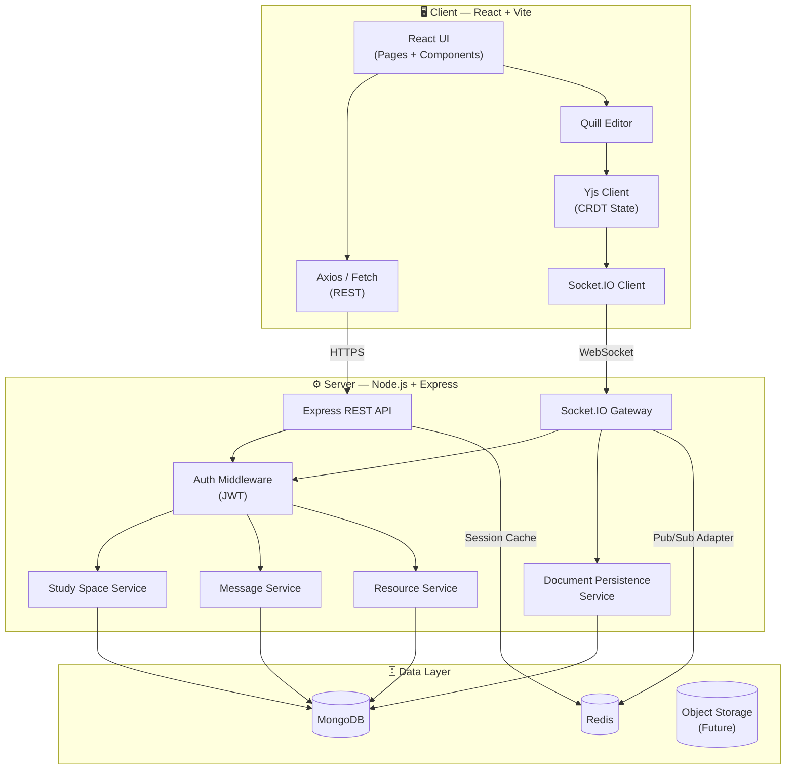
```mermaid
graph TB
    subgraph Client["🖥️ Client — React + Vite"]
        UI["React UI<br/>(Pages + Components)"]
        QE["Quill Editor"]
        YC["Yjs Client<br/>(CRDT State)"]
        SC["Socket.IO Client"]
        AX["Axios / Fetch<br/>(REST)"]
    end

    subgraph Server["⚙️ Server — Node.js + Express"]
        REST["Express REST API"]
        SIO["Socket.IO Gateway"]
        AUTH["Auth Middleware<br/>(JWT)"]
        SSS["Study Space Service"]
        MSG["Message Service"]
        RES["Resource Service"]
        DOC["Document Persistence<br/>Service"]
    end

    subgraph Data["🗄️ Data Layer"]
        MONGO[(MongoDB)]
        REDIS[(Redis)]
        OBJ[("Object Storage<br/>(Future)")]
    end

    UI --> AX
    UI --> QE
    QE --> YC
    YC --> SC

    AX -->|HTTPS| REST
    SC -->|WebSocket| SIO

    REST --> AUTH
    AUTH --> SSS
    AUTH --> MSG
    AUTH --> RES
    SIO --> AUTH
    SIO --> DOC

    SSS --> MONGO
    MSG --> MONGO
    RES --> MONGO
    DOC --> MONGO

    SIO -->|Pub/Sub Adapter| REDIS
    REST -->|Session Cache| REDIS
```

### Directory Structure

```
StudySync/
├── 📄 StudySync_PRD.md              # Product Requirements Document
├── 📄 MEMORY.md                     # Implementation tracking
├── 📄 README.md                     # This file
│
├── 📁 client/                       # Frontend — React + Vite + Tailwind v4
│   ├── index.html                   # SPA entry
│   ├── package.json
│   ├── vite.config.js
│   └── src/
│       ├── main.jsx                 # React DOM render
│       ├── App.jsx                  # Router & route definitions
│       ├── index.css                # Tailwind theme tokens
│       ├── App.css                  # Additional styles
│       ├── assets/                  # Static images
│       ├── lib/
│       │   └── api.js               # Axios instance with JWT interceptor
│       ├── context/
│       │   ├── AuthContext.jsx       # Auth state provider (login/register/logout)
│       │   └── SocketContext.jsx     # Socket.IO client context
│       ├── components/
│       │   ├── auth/
│       │   │   └── ProtectedRoute.jsx   # JWT route guard (redirects to /login)
│       │   ├── layout/
│       │   │   └── Topbar.jsx           # App top navigation bar
│       │   ├── space/
│       │   │   ├── CollaborativeEditor.jsx # Quill + Yjs CRDT editor
│       │   │   ├── CreateSpaceModal.jsx    # Modal to create a study space
│       │   │   └── JoinSpaceModal.jsx      # Modal to join via invite code
│       │   └── ui/                  # Reusable UI primitives
│       │       ├── Button.jsx       # Multi-variant button
│       │       ├── Card.jsx         # Compound card component
│       │       ├── Input.jsx        # Styled input
│       │       ├── Label.jsx        # Form label
│       │       └── Modal.jsx        # Reusable modal component
│       └── pages/
│           ├── LandingPage.jsx      # Marketing landing
│           ├── LoginPage.jsx        # Login form
│           ├── SignupPage.jsx       # Registration form
│           ├── DashboardPage.jsx    # User's study spaces dashboard
│           └── WorkspacePage.jsx    # Study space workspace view
│
└── 📁 server/                       # Backend — Express + Mongoose
    ├── .env                         # Environment variables
    ├── index.js                     # Server entry, middleware, startup
    ├── package.json
    ├── config/
    │   ├── db.js                    # MongoDB connection
    │   ├── redis.js                 # Redis connection (optional)
    │   ├── socket.js                # Socket.IO server + JWT auth middleware
    │   └── yjs.js                   # Yjs WebSocket server on /yjs path
    ├── controllers/
    │   ├── authController.js        # register, login, getMe, logout, updateProfile, changePassword
    │   └── spaceController.js       # createSpace, getSpaces, joinSpace, getSpace
    ├── middleware/
    │   ├── auth.js                  # JWT protect middleware
    │   ├── error.js                 # Global error handler
    │   ├── rateLimiter.js           # express-rate-limit (auth + API)
    │   └── validate.js              # express-validator rules & runner
    ├── models/
    │   ├── User.js                  # Mongoose User schema
    │   ├── StudySpace.js            # Study space schema (name, joinCode, ownerId)
    │   └── Membership.js            # Membership schema (spaceId, userId, role)
    ├── routes/
    │   ├── auth.js                  # /api/auth/* routes
    │   └── spaces.js                # /api/spaces/* routes
    ├── scripts/
    │   └── seed.js                  # Database seeder
    └── utils/
        └── generateToken.js         # JWT sign utility
```

### Data Flow

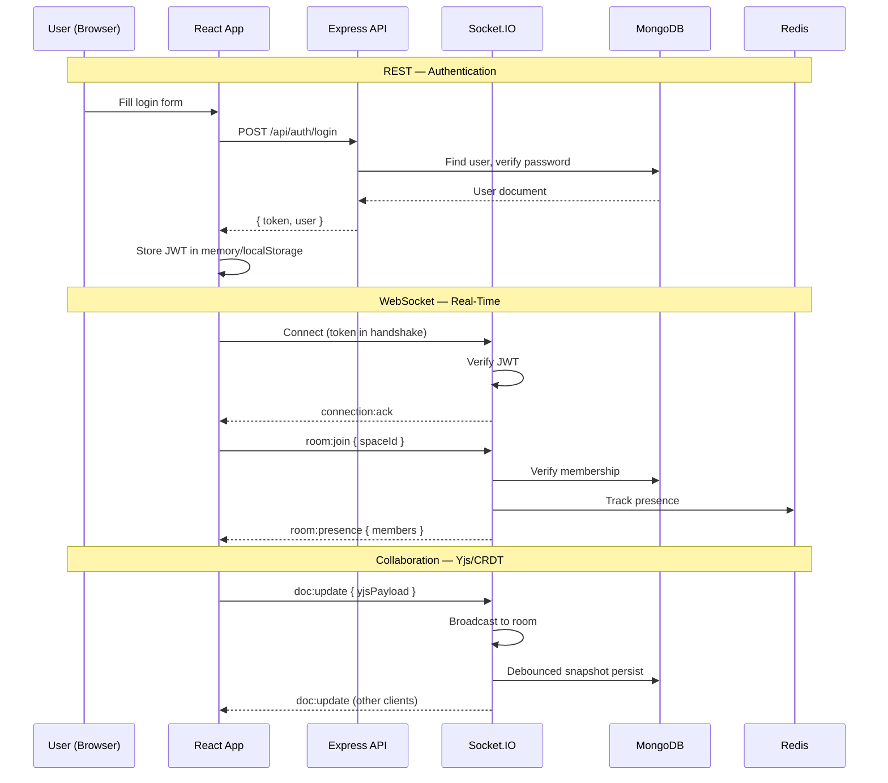
```mermaid
sequenceDiagram
    participant U as User (Browser)
    participant R as React App
    participant E as Express API
    participant S as Socket.IO
    participant M as MongoDB
    participant RD as Redis

    Note over U, RD: REST — Authentication
    U->>R: Fill login form
    R->>E: POST /api/auth/login
    E->>M: Find user, verify password
    M-->>E: User document
    E-->>R: { token, user }
    R->>R: Store JWT in memory/localStorage

    Note over U, RD: WebSocket — Real-Time
    R->>S: Connect (token in handshake)
    S->>S: Verify JWT
    S-->>R: connection:ack
    R->>S: room:join { spaceId }
    S->>M: Verify membership
    S->>RD: Track presence
    S-->>R: room:presence { members }

    Note over U, RD: Collaboration — Yjs/CRDT
    R->>S: doc:update { yjsPayload }
    S->>S: Broadcast to room
    S->>M: Debounced snapshot persist
    S-->>R: doc:update (other clients)
```

---

## Tech Stack

| Layer | Technology | Version | Purpose |
|-------|-----------|---------|---------|
| **Frontend** | React | 19 | Component UI |
| | Vite | 8 | Build tool & dev server |
| | TailwindCSS | 4 | Utility-first styling |
| | React Router | 7 | Client-side routing |
| | Axios | 1.20 | HTTP client with interceptors |
| | Lucide React | — | Icon library |
| | react-hot-toast | 2.6 | Toast notifications |
| | Quill | 2 | Rich-text editor |
| | quill-cursors | 6 | Multi-user cursor display |
| | Yjs | 13.6 | CRDT for collaborative editing |
| | y-quill | 1 | Yjs ↔ Quill binding |
| | y-websocket | 3.1 | Yjs WebSocket transport (client) |
| | Socket.IO Client | 4.8 | WebSocket transport (chat/presence) |
| **Backend** | Node.js | 20+ | Runtime |
| | Express | 5 | HTTP framework |
| | Mongoose | 9 | MongoDB ODM |
| | bcryptjs | 3 | Password hashing |
| | jsonwebtoken | 9 | JWT auth |
| | nanoid | 6 | Short unique join code generation |
| | express-validator | 7 | Request body validation |
| | express-rate-limit | 8 | Rate limiting (auth & API) |
| | ioredis | 6 | Redis client |
| | Socket.IO | 4.8 | WebSocket server (rooms, presence, chat) |
| | @socket.io/redis-adapter | 8.3 | Socket.IO Redis pub/sub adapter |
| | ws | 8 | Raw WebSocket for Yjs server |
| | y-websocket | 1.5 | Yjs WebSocket server utilities |
| | NodeMailer | _planned_ | Email invites |
| **Database** | MongoDB | — | Primary datastore |
| | Redis | — | Pub/Sub, presence, session cache |
| **AI (Phase 2)** | Gemini API | — | Summaries, quizzes, explanations |

---

## Database Schema

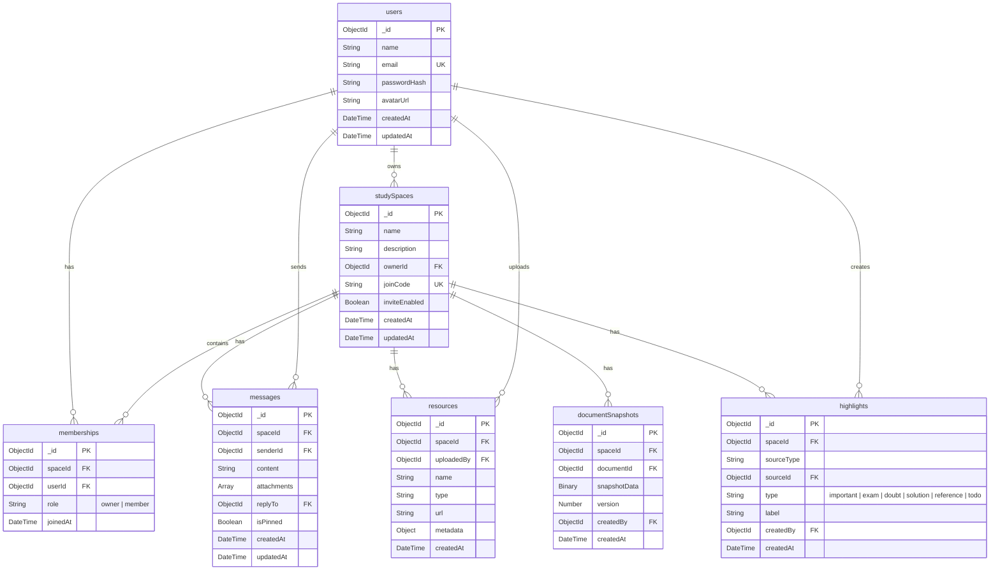
```mermaid
erDiagram
    users {
        ObjectId _id PK
        String name
        String email UK
        String passwordHash
        String avatarUrl
        DateTime createdAt
        DateTime updatedAt
    }

    studySpaces {
        ObjectId _id PK
        String name
        String description
        ObjectId ownerId FK
        String joinCode UK
        Boolean inviteEnabled
        DateTime createdAt
        DateTime updatedAt
    }

    memberships {
        ObjectId _id PK
        ObjectId spaceId FK
        ObjectId userId FK
        String role "owner | member"
        DateTime joinedAt
    }

    messages {
        ObjectId _id PK
        ObjectId spaceId FK
        ObjectId senderId FK
        String content
        Array attachments
        ObjectId replyTo FK
        Boolean isPinned
        DateTime createdAt
        DateTime updatedAt
    }

    resources {
        ObjectId _id PK
        ObjectId spaceId FK
        ObjectId uploadedBy FK
        String name
        String type
        String url
        Object metadata
        DateTime createdAt
    }

    documentSnapshots {
        ObjectId _id PK
        ObjectId spaceId FK
        ObjectId documentId FK
        Binary snapshotData
        Number version
        ObjectId createdBy FK
        DateTime createdAt
    }

    highlights {
        ObjectId _id PK
        ObjectId spaceId FK
        String sourceType
        ObjectId sourceId FK
        String type "important | exam | doubt | solution | reference | todo"
        String label
        ObjectId createdBy FK
        DateTime createdAt
    }

    users ||--o{ studySpaces : "owns"
    users ||--o{ memberships : "has"
    studySpaces ||--o{ memberships : "contains"
    studySpaces ||--o{ messages : "has"
    studySpaces ||--o{ resources : "has"
    studySpaces ||--o{ documentSnapshots : "has"
    studySpaces ||--o{ highlights : "has"
    users ||--o{ messages : "sends"
    users ||--o{ resources : "uploads"
    users ||--o{ highlights : "creates"
```

---

## Authentication & Authorization

### JWT Auth Flow

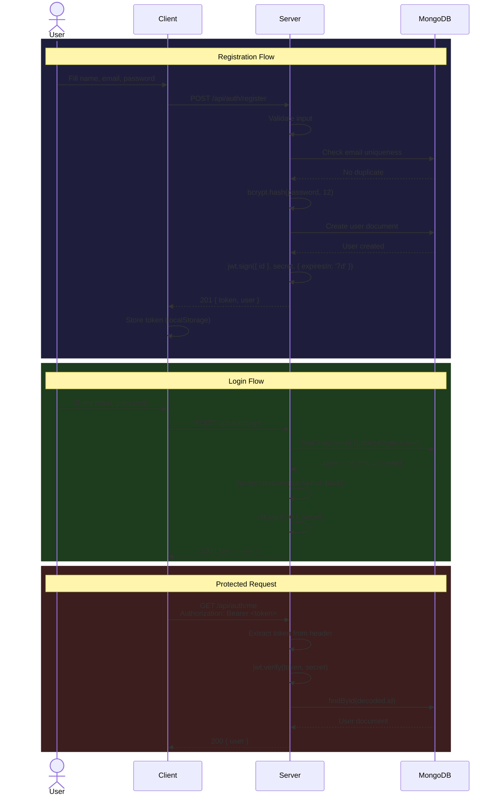
```mermaid
sequenceDiagram
    actor U as User
    participant C as Client
    participant S as Server
    participant DB as MongoDB

    rect rgb(30, 30, 60)
        Note over U, DB: Registration Flow
        U->>C: Fill name, email, password
        C->>S: POST /api/auth/register
        S->>S: Validate input
        S->>DB: Check email uniqueness
        DB-->>S: No duplicate
        S->>S: bcrypt.hash(password, 12)
        S->>DB: Create user document
        DB-->>S: User created
        S->>S: jwt.sign({ id }, secret, { expiresIn: '7d' })
        S-->>C: 201 { token, user }
        C->>C: Store token (localStorage)
    end

    rect rgb(30, 60, 30)
        Note over U, DB: Login Flow
        U->>C: Enter email, password
        C->>S: POST /api/auth/login
        S->>DB: findOne({ email }).select('+password')
        DB-->>S: User + hashed password
        S->>S: bcrypt.compare(password, hash)
        S->>S: jwt.sign({ id }, secret)
        S-->>C: 200 { token, user }
    end

    rect rgb(60, 30, 30)
        Note over U, DB: Protected Request
        C->>S: GET /api/auth/me<br/>Authorization: Bearer <token>
        S->>S: Extract token from header
        S->>S: jwt.verify(token, secret)
        S->>DB: findById(decoded.id)
        DB-->>S: User document
        S-->>C: 200 { user }
    end
```

### Permission Model (RBAC)

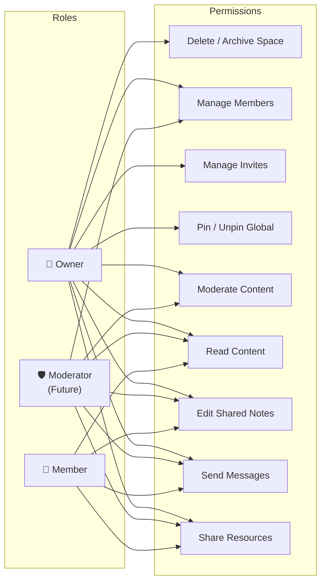
```mermaid
graph LR
    subgraph Roles
        O["👑 Owner"]
        M["👤 Member"]
        MOD["🛡️ Moderator<br/>(Future)"]
    end

    subgraph Permissions
        P1["Delete / Archive Space"]
        P2["Manage Members"]
        P3["Manage Invites"]
        P4["Pin / Unpin Global"]
        P5["Moderate Content"]
        P6["Read Content"]
        P7["Edit Shared Notes"]
        P8["Send Messages"]
        P9["Share Resources"]
    end

    O --> P1
    O --> P2
    O --> P3
    O --> P4
    O --> P5
    O --> P6
    O --> P7
    O --> P8
    O --> P9

    MOD --> P5
    MOD --> P2
    MOD --> P6
    MOD --> P7
    MOD --> P8
    MOD --> P9

    M --> P6
    M --> P7
    M --> P8
    M --> P9
```

### WebSocket Auth Flow

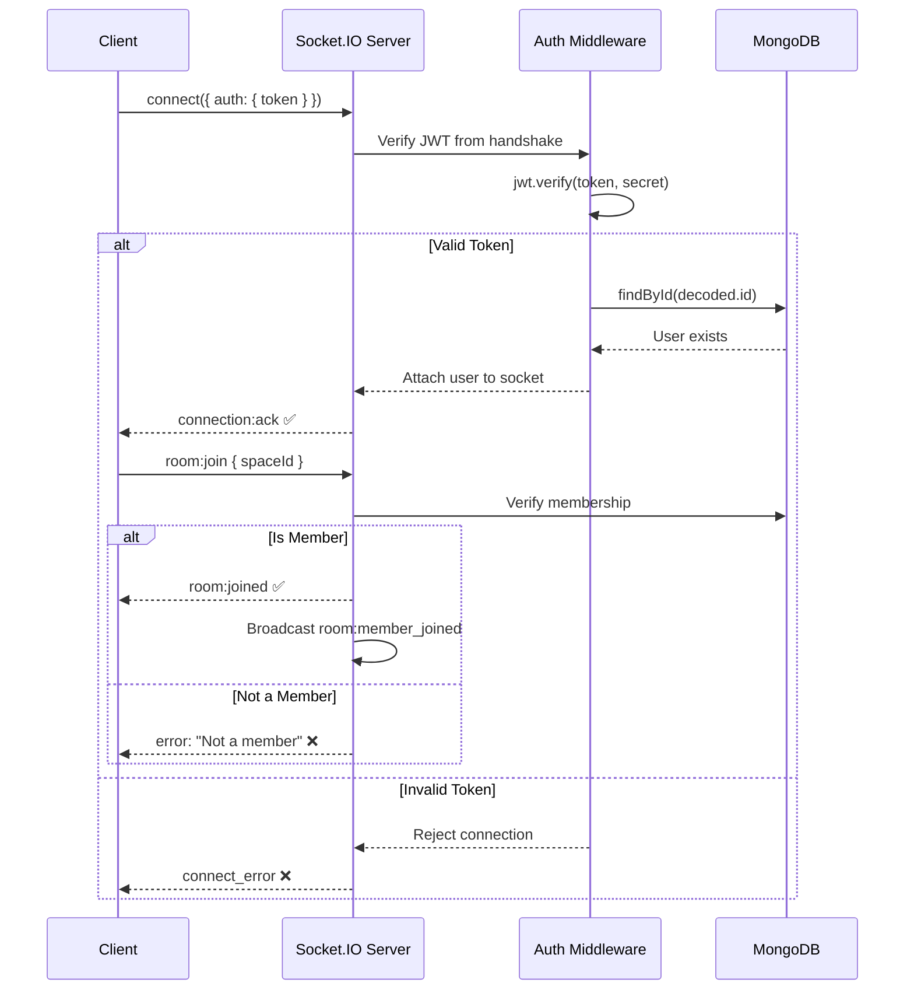
```mermaid
sequenceDiagram
    participant C as Client
    participant SIO as Socket.IO Server
    participant AUTH as Auth Middleware
    participant DB as MongoDB

    C->>SIO: connect({ auth: { token } })
    SIO->>AUTH: Verify JWT from handshake
    AUTH->>AUTH: jwt.verify(token, secret)

    alt Valid Token
        AUTH->>DB: findById(decoded.id)
        DB-->>AUTH: User exists
        AUTH-->>SIO: Attach user to socket
        SIO-->>C: connection:ack ✅
        C->>SIO: room:join { spaceId }
        SIO->>DB: Verify membership
        alt Is Member
            SIO-->>C: room:joined ✅
            SIO->>SIO: Broadcast room:member_joined
        else Not a Member
            SIO-->>C: error: "Not a member" ❌
        end
    else Invalid Token
        AUTH-->>SIO: Reject connection
        SIO-->>C: connect_error ❌
    end
```

---

## API Reference

### Auth Routes

| Method | Endpoint | Auth | Rate Limited | Description |
|--------|----------|------|-------------|-------------|
| `POST` | `/api/auth/register` | Public | ✅ authLimiter (20/15min) | Register new user |
| `POST` | `/api/auth/login` | Public | ✅ authLimiter (20/15min) | Login with credentials |
| `GET` | `/api/auth/me` | 🔒 JWT | — | Get current user profile |
| `POST` | `/api/auth/logout` | 🔒 JWT | — | Logout (client-side token removal) |
| `PATCH` | `/api/auth/profile` | 🔒 JWT | — | Update user name |
| `PATCH` | `/api/auth/password` | 🔒 JWT | — | Change password |

**Register Request:**
```json
{
  "name": "Priyansh",
  "email": "priyansh@example.com",
  "password": "securePassword123"
}
```

> **Validation Rules:** Name 2–50 chars, valid email, password ≥ 6 chars with at least one number.

**Auth Response:**
```json
{
  "success": true,
  "token": "eyJhbGciOiJIUzI1NiIs...",
  "user": {
    "id": "66f1a2b3c4d5e6f7a8b9c0d1",
    "name": "Priyansh",
    "email": "priyansh@example.com",
    "createdAt": "2026-09-24T02:00:00.000Z"
  }
}
```

---

### Study Space Routes

> All space routes are protected by JWT auth and rate limited (200 req/15min via `apiLimiter`).
> Join codes are auto-generated using **nanoid** in `XXX-XXX` format (6 uppercase alphanumeric characters).

| Method | Endpoint | Auth | Status | Description |
|--------|----------|------|--------|-------------|
| `POST` | `/api/spaces` | 🔒 JWT | ✅ Done | Create a new study space (auto-generates join code via nanoid) |
| `GET` | `/api/spaces` | 🔒 JWT | ✅ Done | List user's study spaces (with member count & role) |
| `GET` | `/api/spaces/:id` | 🔒 JWT + Member | ✅ Done | Get space details (membership verified) |
| `POST` | `/api/spaces/join` | 🔒 JWT | ✅ Done | Join a space via invite code |
| `PATCH` | `/api/spaces/:spaceId` | 🔒 Owner | 🔜 Planned | Update space settings |
| `DELETE` | `/api/spaces/:spaceId` | 🔒 Owner | 🔜 Planned | Delete/archive space |
| `POST` | `/api/spaces/:spaceId/leave` | 🔒 Member | 🔜 Planned | Leave a space |

**Create Space Request:**
```json
{
  "name": "CS101 Study Group",
  "description": "Preparing for midterms"
}
```

**Create Space Response:**
```json
{
  "success": true,
  "space": {
    "_id": "66f1a2b3c4d5e6f7a8b9c0d1",
    "name": "CS101 Study Group",
    "description": "Preparing for midterms",
    "joinCode": "7KQ-9PM",
    "ownerId": "...",
    "inviteEnabled": true,
    "membersCount": 1
  }
}
```

**Join Space Request:**
```json
{ "code": "7KQ-9PM" }
```

---

### Invite Routes

| Method | Endpoint | Auth | Status | Description |
|--------|----------|------|--------|-------------|
| `POST` | `/api/spaces/join` | 🔒 JWT | ✅ Done | Join via invite code (handled in space routes) |
| `POST` | `/api/spaces/:spaceId/invites` | 🔒 Owner | 🔜 Planned | Generate invite link/code |
| `POST` | `/api/spaces/:spaceId/invites/email` | 🔒 Owner | 🔜 Planned | Send email invitation |
| `POST` | `/api/spaces/:spaceId/invites/regenerate` | 🔒 Owner | 🔜 Planned | Regenerate invite code |

---

### Message Routes

| Method | Endpoint | Auth | Description |
|--------|----------|------|-------------|
| `GET` | `/api/spaces/:spaceId/messages` | 🔒 Member | Get message history |
| `POST` | `/api/spaces/:spaceId/messages` | 🔒 Member | Send a message |
| `PATCH` | `/api/messages/:messageId` | 🔒 Author | Edit own message |
| `DELETE` | `/api/messages/:messageId` | 🔒 Author | Delete own message |

---

### Resource Routes

| Method | Endpoint | Auth | Description |
|--------|----------|------|-------------|
| `POST` | `/api/spaces/:spaceId/resources` | 🔒 Member | Upload/add resource |
| `GET` | `/api/spaces/:spaceId/resources` | 🔒 Member | List resources |
| `DELETE` | `/api/resources/:resourceId` | 🔒 Author/Owner | Delete resource |

---

### Pin & Highlight Routes

| Method | Endpoint | Auth | Description |
|--------|----------|------|-------------|
| `POST` | `/api/spaces/:spaceId/pins` | 🔒 Member | Pin a message/resource |
| `DELETE` | `/api/pins/:pinId` | 🔒 Pinner/Owner | Unpin |
| `POST` | `/api/spaces/:spaceId/highlights` | 🔒 Member | Highlight content |
| `DELETE` | `/api/highlights/:highlightId` | 🔒 Creator/Owner | Remove highlight |

---

## WebSocket Events

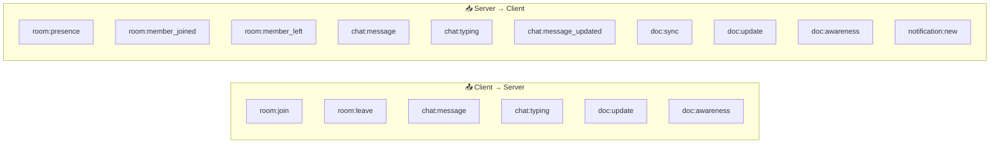
```mermaid
graph LR
    subgraph Client_Events["📤 Client → Server"]
        CE1["room:join"]
        CE2["room:leave"]
        CE3["chat:message"]
        CE4["chat:typing"]
        CE5["doc:update"]
        CE6["doc:awareness"]
    end

    subgraph Server_Events["📥 Server → Client"]
        SE1["room:presence"]
        SE2["room:member_joined"]
        SE3["room:member_left"]
        SE4["chat:message"]
        SE5["chat:typing"]
        SE6["chat:message_updated"]
        SE7["doc:sync"]
        SE8["doc:update"]
        SE9["doc:awareness"]
        SE10["notification:new"]
    end
```

| Event | Direction | Payload | Description |
|-------|-----------|---------|-------------|
| `connection` | Client → Server | `{ auth: { token } }` | WebSocket handshake with JWT |
| `room:join` | Client → Server | `{ spaceId }` | Join a study space room |
| `room:leave` | Client → Server | `{ spaceId }` | Leave a study space room |
| `room:presence` | Server → Client | `{ members: [...] }` | Current online members |
| `room:member_joined` | Server → Client | `{ userId, name }` | Member joined notification |
| `room:member_left` | Server → Client | `{ userId, name }` | Member left notification |
| `chat:message` | Bidirectional | `{ content, senderId, timestamp }` | New chat message |
| `chat:typing` | Bidirectional | `{ userId, isTyping }` | Typing indicator |
| `chat:message_updated` | Server → Client | `{ messageId, content }` | Edited message |
| `doc:sync` | Server → Client | `{ yjsState }` | Initial Yjs state sync |
| `doc:update` | Bidirectional | `{ yjsBinaryUpdate }` | Yjs incremental update |
| `doc:awareness` | Bidirectional | `{ cursor, selection, userId }` | Cursor & presence awareness |
| `notification:new` | Server → Client | `{ type, message }` | In-app notification |

---

## Real-Time Collaboration (CRDT)

### Why Yjs / CRDT?

A naive approach of broadcasting editor state causes **conflicts** when users edit concurrently:

```
Client A types "Hello" → Server → Client B
Client B types "World" → Server → Client A
❌ Result: One edit overwrites the other
```

StudySync uses **Yjs** (a CRDT library) so that document changes are represented as collaborative operations and all replicas converge automatically.

### Collaboration Architecture

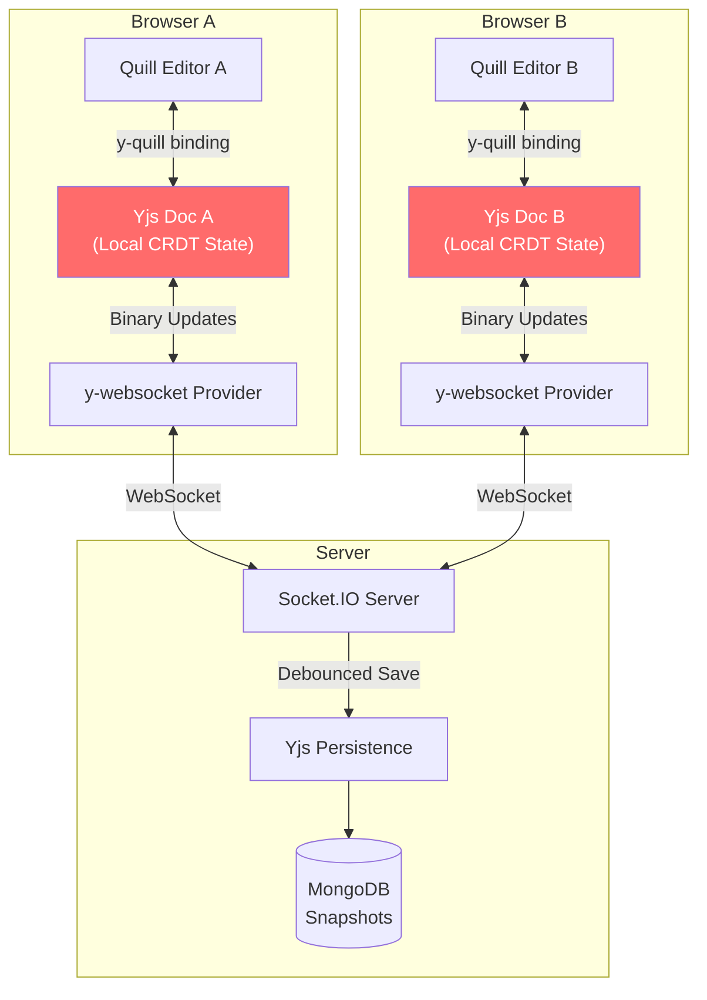
```mermaid
graph TB
    subgraph Browser_A["Browser A"]
        QA["Quill Editor A"]
        YA["Yjs Doc A<br/>(Local CRDT State)"]
        WA["y-websocket Provider"]
    end

    subgraph Browser_B["Browser B"]
        QB["Quill Editor B"]
        YB["Yjs Doc B<br/>(Local CRDT State)"]
        WB["y-websocket Provider"]
    end

    subgraph Server_Layer["Server"]
        SIO_S["Socket.IO Server"]
        YS["Yjs Persistence"]
        MONGO_S[(MongoDB<br/>Snapshots)]
    end

    QA <-->|y-quill binding| YA
    YA <-->|Binary Updates| WA
    WA <-->|WebSocket| SIO_S

    QB <-->|y-quill binding| YB
    YB <-->|Binary Updates| WB
    WB <-->|WebSocket| SIO_S

    SIO_S -->|Debounced Save| YS
    YS --> MONGO_S

    style YA fill:#ff6b6b,color:#fff
    style YB fill:#ff6b6b,color:#fff
```

### CRDT Convergence Flow

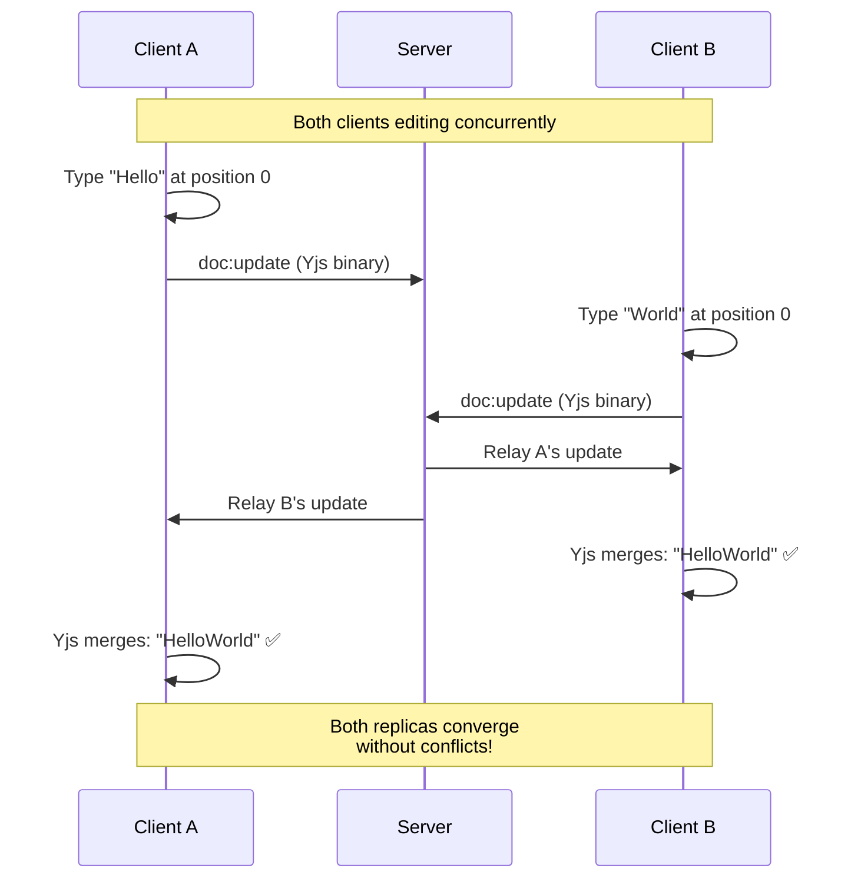
```mermaid
sequenceDiagram
    participant A as Client A
    participant S as Server
    participant B as Client B

    Note over A, B: Both clients editing concurrently

    A->>A: Type "Hello" at position 0
    A->>S: doc:update (Yjs binary)
    B->>B: Type "World" at position 0
    B->>S: doc:update (Yjs binary)

    S->>B: Relay A's update
    S->>A: Relay B's update

    B->>B: Yjs merges: "HelloWorld" ✅
    A->>A: Yjs merges: "HelloWorld" ✅

    Note over A, B: Both replicas converge<br/>without conflicts!
```

### Reconnection Handling

```mermaid
stateDiagram-v2
    [*] --> Connected: WebSocket connected

    Connected --> Editing: User types
    Editing --> Connected: Idle

    Connected --> Disconnected: Network failure

    Disconnected --> LocalEditing: Continue working offline
    LocalEditing --> Disconnected: Still offline

    Disconnected --> Reconnecting: Network restored
    Reconnecting --> Syncing: Connection established
    Syncing --> Connected: CRDT state merged

    state Disconnected {
        note left: Local Yjs doc<br/>continues to track<br/>all changes
    }

    state Syncing {
        note right: Yjs syncs pending<br/>updates with server<br/>No data loss
    }
```

---

## User Journeys

### User Journey — Create & Collaborate

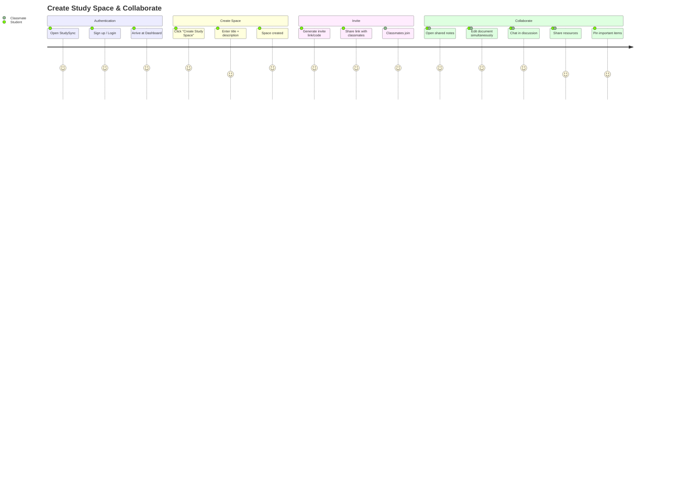
```mermaid
journey
    title Create Study Space & Collaborate
    section Authentication
      Open StudySync: 5: Student
      Sign up / Login: 5: Student
      Arrive at Dashboard: 5: Student
    section Create Space
      Click "Create Study Space": 5: Student
      Enter title + description: 4: Student
      Space created: 5: Student
    section Invite
      Generate invite link/code: 5: Student
      Share link with classmates: 5: Student
      Classmates join: 5: Classmate
    section Collaborate
      Open shared notes: 5: Student, Classmate
      Edit document simultaneously: 5: Student, Classmate
      Chat in discussion: 5: Student, Classmate
      Share resources: 4: Student, Classmate
      Pin important items: 4: Student
```

### User Journey — Late Joiner


```mermaid
journey
    title Late Joiner Catches Up
    section Join
      Receive invite link: 5: Late Joiner
      Click link, login: 5: Late Joiner
      Join study space: 5: Late Joiner
    section Catch Up
      View pinned items: 5: Late Joiner
      View highlights: 5: Late Joiner
      Read activity history: 4: Late Joiner
      Open shared notes: 5: Late Joiner
      Review resources: 4: Late Joiner
    section Participate
      Edit notes: 5: Late Joiner
      Send messages: 5: Late Joiner
      Share own resources: 4: Late Joiner
```

### User Journey — Share & Preserve Solutions

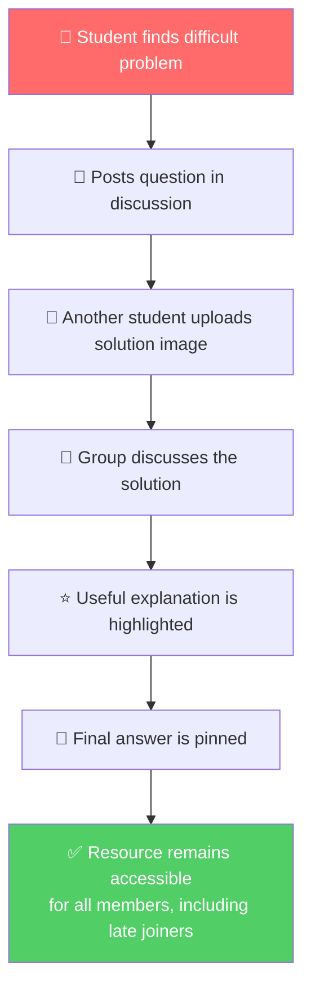
```mermaid
flowchart TD
    A["🤔 Student finds difficult problem"] --> B["📝 Posts question in discussion"]
    B --> C["📸 Another student uploads solution image"]
    C --> D["💬 Group discusses the solution"]
    D --> E["⭐ Useful explanation is highlighted"]
    E --> F["📌 Final answer is pinned"]
    F --> G["✅ Resource remains accessible<br/>for all members, including late joiners"]

    style A fill:#ff6b6b,color:#fff
    style G fill:#51cf66,color:#fff
```

---

## Invite & Join System

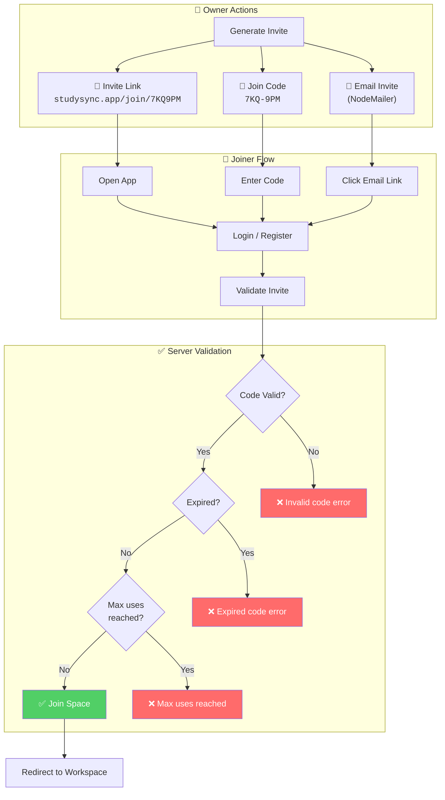
```mermaid
flowchart TD
    subgraph Owner_Actions["👑 Owner Actions"]
        G["Generate Invite"]
        G --> IL["📎 Invite Link<br/><code>studysync.app/join/7KQ9PM</code>"]
        G --> IC["🔢 Join Code<br/><code>7KQ-9PM</code>"]
        G --> EM["📧 Email Invite<br/>(NodeMailer)"]
    end

    subgraph Joiner_Flow["👤 Joiner Flow"]
        IL --> OA["Open App"]
        IC --> EC["Enter Code"]
        EM --> CL["Click Email Link"]

        OA --> LI["Login / Register"]
        EC --> LI
        CL --> LI

        LI --> VL["Validate Invite"]
    end

    subgraph Validation["✅ Server Validation"]
        VL --> CK{"Code Valid?"}
        CK -->|Yes| EX{"Expired?"}
        CK -->|No| ERR["❌ Invalid code error"]
        EX -->|No| MC{"Max uses<br/>reached?"}
        EX -->|Yes| ERR2["❌ Expired code error"]
        MC -->|No| JOIN["✅ Join Space"]
        MC -->|Yes| ERR3["❌ Max uses reached"]
    end

    JOIN --> WS["Redirect to Workspace"]

    style JOIN fill:#51cf66,color:#fff
    style ERR fill:#ff6b6b,color:#fff
    style ERR2 fill:#ff6b6b,color:#fff
    style ERR3 fill:#ff6b6b,color:#fff
```

---

## Redis & Horizontal Scaling

### Single Server (MVP)

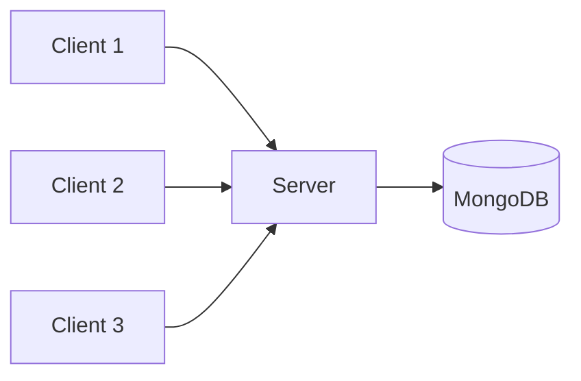
```mermaid
graph LR
    C1["Client 1"] --> S["Server"]
    C2["Client 2"] --> S
    C3["Client 3"] --> S
    S --> M[(MongoDB)]
```

### Multi-Server with Redis (Production)

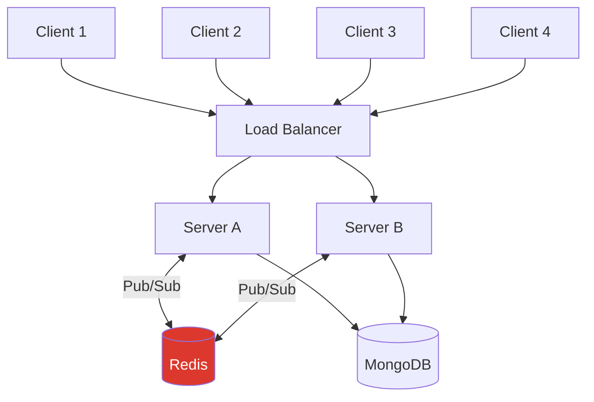
```mermaid
graph TB
    C1["Client 1"] --> LB["Load Balancer"]
    C2["Client 2"] --> LB
    C3["Client 3"] --> LB
    C4["Client 4"] --> LB

    LB --> S1["Server A"]
    LB --> S2["Server B"]

    S1 <-->|Pub/Sub| REDIS[(Redis)]
    S2 <-->|Pub/Sub| REDIS

    S1 --> MONGO[(MongoDB)]
    S2 --> MONGO

    style REDIS fill:#DC382D,color:#fff
```

Without Redis, Server A and Server B cannot relay Socket.IO events to each other's connected clients. The **Socket.IO Redis Adapter** solves this by publishing events to Redis, where all server instances subscribe.

---

## Getting Started

### Prerequisites

| Requirement | Version |
|-------------|---------|
| Node.js | 20+ |
| npm | 10+ |
| MongoDB | 7+ (or MongoDB Atlas) |
| Redis | 7+ (optional, or Upstash) |
| Git | Latest |

### Installation

```bash
# Clone the repository
git clone https://github.com/yourusername/studysync.git
cd studysync

# Install server dependencies
cd server
npm install

# Install client dependencies
cd ../client
npm install
```

### Environment Variables

Create `server/.env`:

```env
# Server
PORT=5000
NODE_ENV=development
CLIENT_URL=http://localhost:5173

# MongoDB
MONGO_URI=mongodb://localhost:27017/studysync

# JWT
JWT_SECRET=your_super_secret_jwt_key_change_in_production
JWT_EXPIRE=7d

# Redis (Optional — works without it)
# Sign up at https://upstash.com → Create Redis → Copy connection string
REDIS_URL=

# Email (Future — NodeMailer)
# SMTP_HOST=smtp.gmail.com
# SMTP_PORT=587
# SMTP_USER=your-email@gmail.com
# SMTP_PASS=your-app-password
```

### Running Locally

```bash
# Terminal 1 — Start the backend
cd server
npm run dev          # Uses nodemon for hot-reload

# Terminal 2 — Start the frontend
cd client
npm run dev          # Vite dev server at http://localhost:5173
```

| Service | URL |
|---------|-----|
| Frontend | `http://localhost:5173` |
| Backend API | `http://localhost:5000` |
| Health Check | `http://localhost:5000/api/health` |

### Seed Database

```bash
cd server
node scripts/seed.js
# Creates a test user: test@studysync.com / password123
```

---

## Development Roadmap

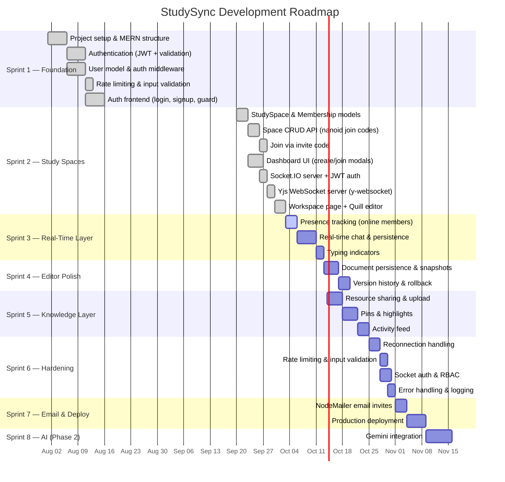
```mermaid
gantt
    title StudySync Development Roadmap
    dateFormat YYYY-MM-DD
    axisFormat %b %d

    section Sprint 1 — Foundation
    Project setup & MERN structure       :done, s1a, 2026-08-01, 5d
    Authentication (JWT + validation)    :done, s1b, after s1a, 5d
    User model & auth middleware         :done, s1c, after s1a, 5d
    Rate limiting & input validation     :done, s1d, after s1c, 2d
    Auth frontend (login, signup, guard) :done, s1e, after s1b, 5d

    section Sprint 2 — Study Spaces
    StudySpace & Membership models       :done, s2a, 2026-09-20, 3d
    Space CRUD API (nanoid join codes)   :done, s2b, after s2a, 3d
    Join via invite code                 :done, s2c, after s2b, 2d
    Dashboard UI (create/join modals)    :done, s2d, after s2a, 4d
    Socket.IO server + JWT auth          :done, s2e, after s2b, 2d
    Yjs WebSocket server (y-websocket)   :done, s2f, after s2e, 2d
    Workspace page + Quill editor        :done, s2g, after s2f, 3d

    section Sprint 3 — Real-Time Layer
    Presence tracking (online members)   :active, s3a, after s2g, 3d
    Real-time chat & persistence         :s3b, after s3a, 5d
    Typing indicators                    :s3c, after s3b, 2d

    section Sprint 4 — Editor Polish
    Document persistence & snapshots     :s4a, after s3c, 4d
    Version history & rollback           :s4b, after s4a, 3d

    section Sprint 5 — Knowledge Layer
    Resource sharing & upload            :s5a, after s4c, 4d
    Pins & highlights                    :s5b, after s5a, 4d
    Activity feed                        :s5c, after s5b, 3d

    section Sprint 6 — Hardening
    Reconnection handling                :s6a, after s5c, 3d
    Rate limiting & input validation     :s6b, after s6a, 2d
    Socket auth & RBAC                   :s6c, after s6a, 3d
    Error handling & logging             :s6d, after s6b, 2d

    section Sprint 7 — Email & Deploy
    NodeMailer email invites             :s7a, after s6d, 3d
    Production deployment                :s7b, after s7a, 5d

    section Sprint 8 — AI (Phase 2)
    Gemini integration                   :s8a, after s7b, 7d
```

---

## Deployment

### Recommended Architecture

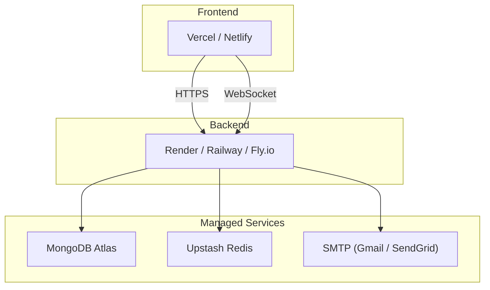
```mermaid
graph TB
    subgraph Frontend["Frontend"]
        V["Vercel / Netlify"]
    end

    subgraph Backend["Backend"]
        R["Render / Railway / Fly.io"]
    end

    subgraph Services["Managed Services"]
        MA["MongoDB Atlas"]
        UP["Upstash Redis"]
        SM["SMTP (Gmail / SendGrid)"]
    end

    V -->|HTTPS| R
    V -->|WebSocket| R
    R --> MA
    R --> UP
    R --> SM
```

| Component | Service | Notes |
|-----------|---------|-------|
| Frontend | Vercel / Netlify | SPA hosting |
| Backend | Render / Railway / Fly.io | Must support persistent WebSocket |
| Database | MongoDB Atlas | Free tier available |
| Redis | Upstash | Serverless Redis, free tier |
| Email | Gmail App Password / SendGrid | For invite emails |

> ⚠️ **Important:** The deployment platform must support **persistent WebSocket connections**. A platform that only handles normal HTTP will break the core real-time features.

---

## Testing Strategy

### Test Matrix

| Category | Tool | Scenarios |
|----------|------|-----------|
| **Unit Tests** | Jest / Vitest | Auth services, invite validation, permission checks, pin/highlight ops |
| **Integration Tests** | Supertest | API auth flow, space CRUD, invite flow, message persistence |
| **Real-Time Tests** | Socket.IO Client (test) | Concurrent editing, disconnect/reconnect, room isolation, unauthorized access |

### Critical Test Scenarios

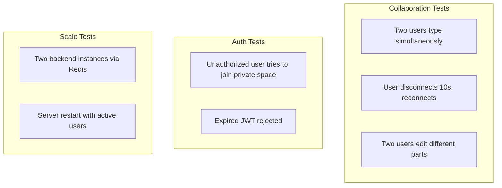
```mermaid
graph TD
    subgraph Collab["Collaboration Tests"]
        T1["Two users type simultaneously"]
        T2["User disconnects 10s, reconnects"]
        T3["Two users edit different parts"]
    end

    subgraph Auth_Tests["Auth Tests"]
        T4["Unauthorized user tries to join private space"]
        T5["Expired JWT rejected"]
    end

    subgraph Scale["Scale Tests"]
        T6["Two backend instances via Redis"]
        T7["Server restart with active users"]
    end
```

---

## Contributing

1. Fork the repository
2. Create a feature branch: `git checkout -b feature/amazing-feature`
3. Commit your changes: `git commit -m 'feat: add amazing feature'`
4. Push to the branch: `git push origin feature/amazing-feature`
5. Open a Pull Request

### Commit Convention

| Prefix | Usage |
|--------|-------|
| `feat:` | New feature |
| `fix:` | Bug fix |
| `docs:` | Documentation |
| `style:` | Code style (no logic change) |
| `refactor:` | Code restructure |
| `test:` | Tests |
| `chore:` | Build/config changes |

---

## License

This project is developed as part of the **Full Stack Development** course (Semester 5, B.Tech) as an innovative assignment.

---

<p align="center">
  <b>Built with ❤️ by Priyansh Patel & Kaivalya Bhatt</b><br/>
  <i>"Don't build another generic notes app. Build a shared digital study room."</i>
</p>
